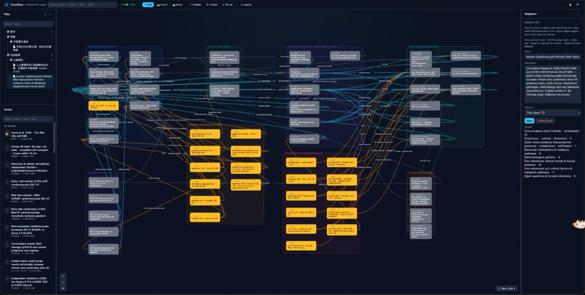
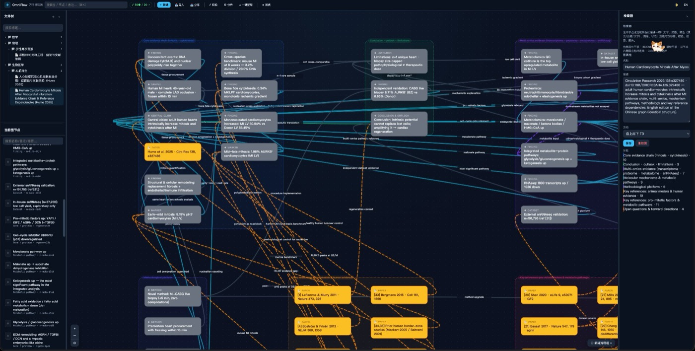

<h1 align="center">OmniFlow</h1>

<p align="center"><strong>Everything is a graph.</strong></p>

<p align="center">A universal flow-map plugin: theorem dependencies, paper relations, task RACI, org structure, research collaboration, conversation maps — with every color, shape and arrow label customizable. Zero-dep CLI + visual Studio canvas.</p>

<p align="center">
  <a href="LICENSE"></a>
  
</p>

<p align="center">📖 <a href="docs/TUTORIAL.md">Complete tutorial</a> · <a href="docs/API.md">API reference</a> · <a href="docs/FORMULAS.md">Formula rules</a></p>

<p align="center">
  
</p>
<p align="center"><em>The Studio canvas — 59 typed nodes and 90 labeled edges with colored group containers, per-node Markdown notes and a live inspector. Local-only, zero dependencies.</em></p>

<p align="center">
  
</p>
<p align="center"><em>Zoomed in: every edge carries a semantic label (uses / confirms / contradicts / required-for); paper nodes keep their DOI and local path in the node note.</em></p>

## What it gives you

- **10 built-in node types + 18 edge semantics** — theorem/lemma/proposition/definition/paper for math; person/department/task for orgs; R/A/C/I responsibility edges; follows/answers/merges for conversations. Custom types are one JSON block away.
- **Everything is customizable** — per node: fill / border / text color, shape (8 kinds), icon, size, status badge; per edge: **a named label**, color, width, line style, arrow direction. Nothing is locked.
- **Analysis, not just drawing** — cycle detection, degree-centrality bottleneck report (find the single point of failure in your RACI chart), upstream/downstream dependency closure, one-key layered layout (cycle-tolerant).
- **Text-first, AI-friendly** — import/export Mermaid, Graphviz DOT, Markdown outline and JSON. `graph.json` is the single source of truth and diffs cleanly in Git. Batch-build diagrams by pasting Mermaid.
- **agent-flow bridge** — `of import-af <id>` turns any [AgentFlow](https://github.com/kanghelyu/agent-flow) workflow into a diagram (gates become Yes/No labeled edges). OmniFlow maps; AgentFlow executes.
- **Groups, notes, search, legend** — colored subgraph containers, per-node Markdown notes, instant search with highlight, auto legend from the type registry.
- **Bilingual light/dark Studio** — local-only canvas at `127.0.0.1:4319`, zh/en UI.
- **Academic-ready math rendering** — offline KaTeX 0.18.7 with the mhchem chemistry extension. Notes and previews compile `$inline$`, `$$display$$`, `\(..\)`, `\[..\]`, **bare LaTeX paragraphs without delimiters**, and even a full paper source (preamble stripped automatically). Unsupported constructs degrade to visible source with a hint — nothing is ever lost.
- **Four layouts** — layered by dependency · cluster by groups · force-directed · compact grid. Also available via `of_layout { mode }`.
- **Follows your system theme** — light/dark auto-detected on first run; explicit choice wins and is remembered.
- **Deep links & map jumping** — `#<graphId>` opens a map, `#<graphId>/<nodeId>` focuses a node; tag a node `open:<otherGraphId>` and double-click the ↗ badge to jump between maps.
- **Double-click launchers** — `Start-Studio.command` (macOS/Linux) and `Start-Studio.bat` (Windows) find Node, pick a free port and open the browser.

## Recommended install: give this repository to your agent

The best way to install OmniFlow is to **point your coding agent at this repository** (or paste the URL into the chat) and ask it to run the installer itself:

```text
https://github.com/kanghelyu/omni-flow
```

OmniFlow is **harness-agnostic**: the same repository works with ZCode, Claude Code, Codex CLI, Cursor, Windsurf, or any agent that can run a shell command — on macOS, Windows, or Linux. The agent will:

1. clone or fetch this repository;
2. run `install.sh` (macOS/Linux) or `install.ps1` (Windows);
3. **automatically drop the bundled `omni-flow` skill** into ZCode (`~/.zcode/skills/omni-flow`), Claude Code (`~/.claude/skills/omni-flow`), and Codex (`$CODEX_HOME/skills/omni-flow`) — so the agent instantly knows all templates, conventions and batch-import tricks;
4. link the `of` CLI into `~/.local/bin`;
5. verify with `of --version` and `of doctor`.

No plugin marketplace, no harness-specific packaging. Re-running the installer always upgrades both the runtime and the skill together.

## Node Markdown: put domain substance inside the graph

Every node owns a Markdown file: `~/.omni-flow/graphs/<id>/notes/<nodeId>.md`.
**The box on canvas is the index; the `.md` holds the actual domain content**:

| Node type | What goes in the `.md` |
| --- | --- |
| Theorem / lemma / proposition | Full statement, proof idea, dependencies, counterexamples |
| Definition | Rigorous definition, notation, intuition |
| Paper | Abstract, key results, relation to your work, open questions |
| Person | CV / bio, research interests, responsibilities, contact |
| Task | Acceptance criteria, context, deliverable links |
| Department / team | Scope, headcount, reporting notes |
| Session / topic | Meeting summary, open questions, action items |

Three equivalent channels: the "Full note" button in Studio, MCP tools `of_set_note` / `of_get_note`, or editing the file directly. The first line shows as a summary on the card.

**Convention: short but dense (≤30 lines), one-line summary first, always attach verifiable identifiers:**

- Papers / books: include the **DOI or arXiv id** (e.g. `arXiv:2203.04205`, `doi:10.1007/978-1-4612-0881-2`); attach the **absolute path or `file://` link** when a local copy exists
- Theorems: full statement + proof idea + list of prerequisite lemmas
- Persons: one-line identity + focus + local CV link
- Tasks: acceptance criteria + deliverable paths
- Sessions: summary + open questions + related sessions

Skeleton example (paper node):

```markdown
Nilpotent Orbits in Semisimple Lie Algebras
- doi:10.1007/978-1-4612-0881-2 | local: ~/Books/nilpotent-orbits.pdf
- Key results: classification of nilpotent orbits, orbit closure order
- Role here: reference for Theorem 4.1
```

## Bundled skill: install the plugin, get the skill; invoke the skill, use the plugin

`skills/omni-flow/SKILL.md` ships with the plugin and is **auto-installed** by both installers into ZCode / Claude Code / Codex skill directories (symlink/junction — single source). For any agent:

- **Invoking the skill = already using OmniFlow** (it contains all usage: template selection, batch import, node `.md` content conventions, analysis recipes) — no separate plugin call needed;
- **Invoking the plugin (CLI/MCP/HTTP) means the skill is already in place**, so agent context is aligned automatically.

## Quick start

```bash
bash install.sh          # macOS / Linux → ~/.omni-flow + of on PATH + skills auto-installed
of doctor
of templates             # 7 scenario templates
of create "paper-deps demo" --template theorem-deps
of studio                # → http://127.0.0.1:4319
```

Windows PowerShell: `Set-ExecutionPolicy -Scope Process Bypass` then `.\install.ps1`.

Requirements: Node.js ≥ 18. Zero npm dependencies.

## Bundled agent skill

`skills/omni-flow/SKILL.md` ships with the plugin and is **installed automatically** by both installers. It teaches any agent:

- how to pick a template for each scenario (theorem deps → `theorem-deps`, team split → `task-raci`, …);
- how to batch-build graphs as text (Mermaid/JSON first, refine in Studio);
- the full-customization surface (node triple colors / 8 shapes / status badges; edge labels, colors, styles, arrows);
- analysis recipes (RACI single-point-of-failure via centrality, proof-chain tracing, cycle audit).

For MCP-capable agents, register the server once and all 61 tools become native tools:

```json
{ "mcpServers": { "omni-flow": { "command": "of", "args": ["mcp"] } } }
```

## Standard interfaces for every agent

OmniFlow exposes **three fully equivalent layers** — pick whichever your agent speaks:

1. **MCP (recommended)** — 61 tools over the standard Model Context Protocol (stdio JSON-RPC 2.0). Works with Claude Code, Codex CLI, WorkBuddy, Cursor, and any MCP client:

```json
{ "mcpServers": { "omni-flow": { "command": "of", "args": ["mcp"] } } }
```

2. **HTTP JSON API** — 21 endpoints + SSE on `127.0.0.1:4319` (start with `of studio --no-open`).
3. **CLI** — 12 subcommands for humans and shell-capable agents.

Full reference: [docs/API.md](docs/API.md).

## Command reference

| Command | Purpose |
| --- | --- |
| `of create <name> [--template id] [--desc]` | Create a graph from a template (default `blank`). |
| `of templates` | List all scenario templates. |
| `of list` / `of read <id>` | List graphs / dump full `graph.json`. |
| `of validate <id>` | Hard errors block; cycles & orphans are warnings (they may be legitimate). |
| `of analyze <id> [--trace nodeId]` | Cycles, centrality bottlenecks, isolated nodes, dependency closure. |
| `of layout <id>` | Layered auto-layout (cycle-tolerant). |
| `of export <id> --format mermaid\|dot\|md\|json [--out file]` | Interop. |
| `of import <file> [--format mermaid\|json] [--name]` | Import from text or JSON. |
| `of import-af <agent-flow-id>` | Import an AgentFlow workflow as a diagram. |
| `of studio [--port N] [--no-open]` | Visual canvas (default `127.0.0.1:4319`). |
| `of delete <id> --yes` | Archive into `<root>/trash/` (recoverable). |
| `of doctor` | Environment self-check. |

## Scenarios

| Scenario | Template | Key edge types |
| --- | --- | --- |
| Theorem dependencies in a math paper | `theorem-deps` | uses / depends-on / cites |
| Cross-paper relation map | `paper-map` | extends / cites / contradicts / generalizes |
| Project task RACI | `task-raci` | raci-r / raci-a / raci-c / raci-i / depends-on |
| Company org structure | `org-structure` | reports-to |
| Research collaboration | `research-collab` | flow / raci-r / depends-on |
| Conversation correlation | `conversation-map` | follows / answers / merges |

## Data model

```json
{
  "nodes": [
    { "id": "thm-1", "type": "theorem", "label": "Theorem 4.1",
      "fill": "#7C3AED", "border": "#6D28D9", "textColor": "#F5F3FF",
      "shape": "rect", "icon": "∎", "status": "doing" }
  ],
  "edges": [
    { "id": "e1", "source": "lem-1", "target": "thm-1",
      "type": "depends-on", "label": "core lemma",
      "color": "#2563EB", "style": "solid", "arrow": "one", "width": 2 }
  ],
  "groups": [ { "label": "Technical track", "color": "#2563EB", "members": ["d-dev"] } ]
}
```

Long notes live at `graphs/<id>/notes/<nodeId>.md` (Markdown-first).

## Relationship to AgentFlow

[AgentFlow](https://github.com/kanghelyu/agent-flow) is a *workflow executor*: Markdown steps, deterministic Boolean gates, a runtime. OmniFlow is a *relationship mapper*: any domain, full visual freedom, graph analysis. Neither replaces the other — OmniFlow can import any AgentFlow workflow for visualization and review.

## Design boundaries

- Local-first: storage under `~/.omni-flow`, Studio binds `127.0.0.1` only, no telemetry.
- Zero dependencies: Node ≥ 18 standard library only.
- `graph.json` is the source of truth — edit it directly if you like; validation runs on every write.

## License

[CC BY-NC 4.0](LICENSE)

## License

[CC BY-NC 4.0](LICENSE) (Attribution-NonCommercial 4.0 International) — free to use, modify and redistribute for **non-commercial** purposes with attribution; commercial use requires a separate license from the author. **Non-viral**: derivative works are not bound by this license and may choose their own terms.
