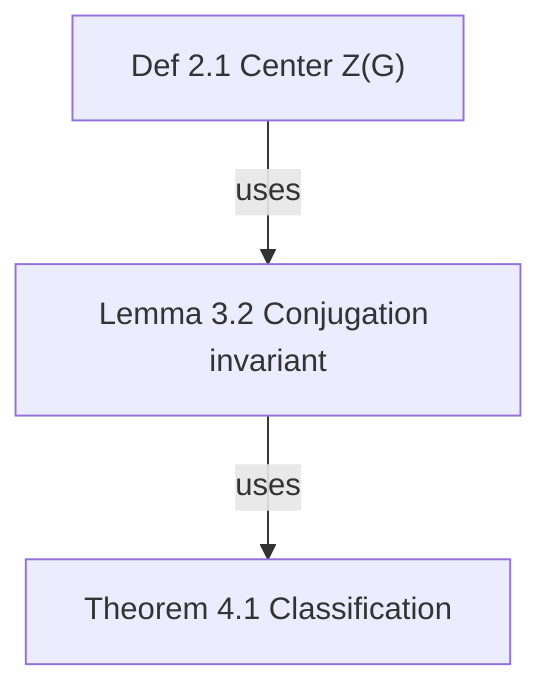

# ⛔ Hard rules (MUST · violating any one of these = the task failed)

> Every rule below comes from a real incident, not from theory. Breaking one always shows up as a broken canvas for the user.

## R0. Declare before you start (MUST)

Before touching anything, state the following in your first reply:

1. **You have read R0–R9 and the 📕 Failure library** (read, not "about to read").
2. **How you will verify**: which `of_*` tools you will use (e.g. `of_latex_check` → write → `of_get_graph` for counts → `of_get_note` for read-back → `of_validate`).
3. **If a rule cannot be satisfied** (e.g. the user explicitly asks to skip validation) → **MUST** stop and surface the conflict for the user to decide; **MUST NOT** silently downgrade, and **MUST NOT** "do it first and patch later".

> **On violation**: revert the artefact, state which rule was broken and why, then redo it correctly. **MUST NOT** present a violating artefact as "done".

## R1. Formulas: KaTeX standard commands only, always self-check before writing

- **MUST** call **`of_latex_check`** before writing anything that contains math (note body, card title, edge label). A non-empty `failed` means **you must not commit** — fix per `hint` and re-check.
- **MUST NOT** define macros with `\newcommand`. The legal set is KaTeX built-ins plus official `mhchem` `\ce{}`.
- **MUST** wrap anything needing `\tag{...}`, `aligned` or matrices in `$$…$$` (`\tag` is illegal inline; the system auto-converts it to a text number, but never rely on that).
- **MUST** keep braces, brackets and `\left`/`\right` balanced — one unclosed pair fails the **whole** fragment.
- **MUST** close every delimiter. An unclosed `$`, `$$`, `\(` or `\[` turns the rest of the text into plain
  prose, so it renders un-warned and reaches the user broken. The gate now rejects it and tells you which
  delimiter is missing. To print a literal dollar sign, write `\$`.
- **MUST NOT** nest `$` inside a formula. Put Chinese (or any prose) inside `\text{…}`.
- To **show LaTeX source itself**, **MUST** put it in a code fence ```` ```…``` ```` (fenced content is exempt from validation).
- Every OmniFlow write channel goes through **one shared pipeline** (`lib/graph-service.mjs`: normalise → formula gate → structure validation → persist), so nothing can bypass it: the MCP tools, the HTTP API, the CLI (`of create` / `of meta` / `of convo …` / `of import*` / `of project …`) and Studio editing all end up on the same path. It **normalises and hard-validates**: an invalid formula is **rejected** with per-fragment `hint`s. This is an interceptor, not a warning — **do not** try to slip content in first.

## R2. Semantic ids: the prerequisite for cross-graph links

- Card ids **MUST** follow `{type-abbrev}-{section}.{n}` (`thm-2.1.1` / `def-2.3.4` / `eq-2.1.2`); they are generated on import — **do not rename them by hand**.
- Fixed abbreviations: `thm def prop lem cor ex rem eq` (papers → `ref`).
- A cross-graph link's `why` **MUST** state the mathematical justification, not "related content".

## R3. Three checks before every write

1. `of_latex_check` is all green (see R1).
2. **Never overwrite existing content with empty or degenerate data**: a whole-graph write must not put an empty graph over a non-empty one.
3. After structural changes, `of_validate` passes (cycles are warnings, not errors — they are allowed).

## R4. Protect the data (MUST)

- **MUST NOT** overwrite an existing graph with empty or degenerate content: before clearing, replacing a whole graph, or bulk-deleting, record the **before** node/edge counts with `of_get_graph`.
- Deletion **MUST** go through OmniFlow's own tools (`of_delete_node` / `of_delete_edge` / `of_delete_graph`, all recoverable from trash). **MUST NOT** hand-delete `graph.json`, `notes/` or graph directories under `~/.omni-flow/`.
- **MUST NOT** recursively delete the storage root or any user directory.
- If a graph "seems to have disappeared", **MUST** check the read path and the server first (storage self-heals on read) — **do not** delete files.

## R5. No skipping, no merging steps

Every numbered step in an SOP is a separate action. Combining two of them is a violation. Do not
compress "create → add node → add edge → set note → validate" into one call.

## R6. Ids and read-backs: never guess, never trust a 200

- **MUST** take every node/edge/group id from the actual return value of `of_add_node` /
  `of_add_edge` / `of_get_graph`; build a "label → real id" map before referencing them.
  **MUST NOT** fabricate or guess an id.
- **MUST** read back after every write (`of_get_graph` for counts, `of_get_note` for note text) and
  compare against what you intended. A bare HTTP/MCP success is not evidence.
- Folder paths **MUST** come from `of_tree` or the user's exact words — never invent a path.

## R7. Filing: check the ledger before creating anything

Read `of_tree` (or `<root>/WORKLOG.txt`) before creating any graph, then:

1. The user named a folder → use it exactly as given.
2. Otherwise, reuse an existing same-topic folder — **never** create a parallel one.
3. Genuinely new domain → create a semantic folder and tell the user.
4. Never dump everything at the root.

## R8. User-supplied material must be processed to the end

Any image, PDF, archive, LaTeX source or export the user drops in **MUST** be unpacked, understood
and actually used (mapped, imported or implemented) in the same task — never summarised away and
never left half-done. If part of it cannot be processed, say which part and why.

## R9. Deliver with the verification output

End every task with the Report Template at the bottom, filled from **actual tool returns** (never
hand-written paths), plus the Pre-delivery self-check results. State plainly what you did *not*
verify.

## Language policy (MUST)

- **This skill and everything under `docs/` is English-only.** New instructions, hints, and documentation text are written in English. Do not add Chinese prose to them.
- **Agent-facing text is English**: MCP tool descriptions, CLI help and CLI messages, validation messages, LaTeX errors and hints, and the API reference.
- **Display data is bilingual by design — do not strip the Chinese side**: the Studio UI (`zh` / `en` toggle), template and node/edge-type labels (a `label` plus a `labelEn`), the standalone HTML canvas (follows the browser language), and the promo page (`data-zh` / `data-en`).
- **User graph content** may be in any language — follow the graph's own `lang` setting (see "Language Rules for Graph Creation").
- Literal trigger phrases the user types (e.g. `开启非线性对话`, `停止记录`) stay verbatim; they are protocol tokens, not prose.

# OmniFlow — Universal Flow Map

Every "elements + relations" structure deserves a map. OmniFlow is domain-agnostic:

| Scenario | Template | Key edge types |
| --- | --- | --- |
| Math paper theorem deps | `theorem-deps` | uses / depends-on / cites |
| Cross-paper relations | `paper-map` | extends / cites / contradicts / generalizes |
| Project task RACI | `task-raci` | raci-r / raci-a / raci-c / raci-i / depends-on |
| Company org structure | `org-structure` | reports-to |
| Research collaboration | `research-collab` | flow / raci-r / depends-on |
| Conversation mapping | `conversation-map` | follows / answers / merges |

## Language Rules for Graph Creation

> This section is about the **language of graph content**. For the language of the skill and docs themselves, see "Language policy" above.

When creating a new flow graph, determine the label language by this priority:

1. **User's language** — if the user communicates in Chinese → `lang: "zh"`; if English → `lang: "en"`.
2. **Source content language** — if mapping an article/paper/notes, match the source document's language.
3. **Default: English** — if neither is determinable, omit `lang` (defaults to `en`).

Pass it explicitly: `of_create_graph { "name": "...", "template": "theorem-deps", "lang": "zh" }`

- The Studio canvas passes the UI language automatically; CLI uses `of create "name" --template X --lang zh|en`.
- Never mix languages within a single graph. Node labels, group labels, edge labels, and notes must all use the same language.
- Notes must be written in the graph's language (English graph → English notes).

## Interfaces: three equal layers

1. **MCP (agent's first choice)**: `of mcp` starts a stdio server with **61 tools** = full capability. mcpServers config: `{"command": "of", "args": ["mcp"]}`. Full list in docs/API.md.
2. **HTTP JSON API**: `of studio --no-open` then call `http://127.0.0.1:4319/api/...` (50+ endpoints + SSE).
3. **CLI**: see "Core Commands" section.

> This skill and the plugin are one unit: installing the plugin auto-deploys this skill; invoking this skill IS using OmniFlow.

---

# SOP-A: Create a "theorem dependency graph" from scratch (full walkthrough)

Every step below is a **required, independent** action. Example: "User: help me map the theorem dependencies of a paper."

**Step 1 · Create graph (with folder determination)**

```json
of_create_graph {
  "name": "Paper theorem deps",
  "template": "theorem-deps",
  "folder": "Math/paper-notes"
}
```

Record from the return: `id`, `storage.graph`, `folder`, `nodes`/`edges` counts. Use this `id` for all subsequent calls — **never hand-write or guess**.

**Step 2 · Read graph to confirm starting point**
```json
of_get_graph { "id": "<graph-id>" }
```
Verify: template's 6 nodes and 5 edges are present; note each node's `id` and `label`.

**Step 3 · (Only if needed) Add custom node type**
```json
of_patch_node_type { "id": "<graph-id>", "type": "conjecture", "label": "Conjecture", "labelEn": "Conjecture", "shape": "diamond", "fill": "#F97316", "border": "#EA580C", "textColor": "#431407", "icon": "?" }
```
✅ Verify: `of_get_graph` returns `nodeTypes.conjecture` with correct fields.

**Step 4 · Add nodes one by one** (only ones not in template; one call per node)
```json
of_add_node { "id": "<graph-id>", "label": "Lemma 3.6 quotient algebra representation", "type": "lemma", "x": 80, "y": 380, "w": 190, "h": 64 }
```
✅ Verify: `nodes.length` = previous + 1, new node `label` correct. **One call per node — never bulk-insert**.

**Step 5 · Fill node notes** (every node must have one; one call per node)

> **MUST** first run `of_latex_check` on the note body if it contains any math (R1) — notes with a failed fragment will be **rejected** by the server (`code: LATEX_INVALID`), returning per-fragment `hint`s. Do not skip the check and "hope it renders".
> `content` is full Markdown (first line = card summary; papers must include DOI/arXiv + local path):
```json
of_set_note { "id": "<graph-id>", "nodeId": "def-sub", "content": "Def 2.1 (Center Z(G) of group G)\nZ(G) = { z ∈ G | ∀g∈G, zg=gz }\n- Notation: all central elements as z_i\n- Intuition: elements commuting with everything" }
```
✅ Verify: `of_get_note` readback matches.

**Step 6 · Connect edges** (one call per edge)
```json
of_add_edge { "id": "<graph-id>", "source": "def-sub", "target": "lem-1", "type": "uses" }
```
✅ Verify: `edges` contains the edge with correct `source/target` direction.

**Step 7 · Label key edges** (optional but recommended)
```json
of_patch_edge { "id": "<graph-id>", "edgeId": "<edge-id-from-step-6>", "patch": { "label": "reduces to" } }
```

**Step 8 · Auto layout**
```json
of_layout { "id": "<graph-id>" }
```

**Step 9 · Validate**
```json
of_validate { "id": "<graph-id>" }
```
Non-empty `issues` → fix each → re-run until only warnings remain.

**Step 10 · Analyze + Report**
```json
of_analyze { "id": "<graph-id>" }
```
Report using the template at the bottom. **Missing any step's verification record = task incomplete**.

---

# SOP-B: Bulk graph creation (Mermaid import route, prefer for >8 nodes)

**Step 1** · Write Mermaid with OmniFlow edge types (labels in `-->|uses|` must be registered types):


**Step 2**:
```json
of_import_mermaid { "text": "<full mermaid above>", "name": "Paper theorem deps", "folder": "Math/paper-notes" }
```
✅ Record returned `id` and `storage.graph`.

**Step 3** · `of_get_graph` to verify node count and edge directions.

**Step 4** · Per-node `of_set_note` (same as SOP-A Step 5, don't skip). **Notes containing formulas MUST pass `of_latex_check` first** (R1).

**Step 5** · `of_validate` → `of_analyze` → Report.

---

# SOP-C: Modify an existing graph

**Add node + edge + note** (all three, no skipping):
```json
of_add_node { "id": "<graph-id>", "label": "Conjecture 5.1 Higher rep extension", "type": "conjecture", "x": 300, "y": 500 }
of_add_edge { "id": "<graph-id>", "source": "<new-node-id>", "target": "thm-1", "type": "extends" }
of_set_note { "id": "<graph-id>", "nodeId": "<new-node-id>", "content": "Conjecture 5.1 …" }
```
New node's `id` comes from `of_add_node` return — **never guess**.

**Move node**: `of_move_node { "id": "<graph-id>", "nodeId": "thm-1", "x": 420, "y": 520 }`

**Style patch**: `of_patch_node { "id": "<graph-id>", "nodeId": "thm-1", "patch": { "fill": "#7C3AED", "border": "#6D28D9", "status": "doing" } }`

**Delete** (edges first, then node):
```json
of_delete_edge { "id": "<graph-id>", "edgeId": "<edge-id>" }
of_delete_node { "id": "<graph-id>", "nodeId": "<node-id>" }
```

---

# SOP-D: Folder tree & work log (Obsidian-style management)

- **View tree**: `of_tree {}` → returns `folders` and `assign` (graph → folder).
- **Create folder**: `of_create_folder { "path": "Projects/my-project" }` (auto-creates ancestors).
- **Move graph**: `of_move_graph { "graphId": "<graph-id>", "folder": "Projects/my-project" }` (empty folder `""` = move to root).

**Work log (must read first)**: Every tree change auto-updates `~/.omni-flow/WORKLOG.txt` — maps graph → folder. Agents **must read `of_tree` (or the file) before every run and before creating any graph**, then follow this decision chain:

1. User specified a folder → **use exactly as given**.
2. Not specified → search WORKLOG/tree for a **same-topic folder**: found → **reuse it**, never create a parallel one.
3. Genuinely new domain → create a semantic folder and inform the user.
4. Never dump all graphs in root; never invent duplicate folders.

---

# SOP-H: Cross-graph dependencies (link nodes in different maps)

Use this when a card in one map depends on a card in another (a lemma in book A that supplies the
criterion used by a theorem in book B, an experiment that validates another project's model, …).

Every step is required, one call each:

**Step 1 · find the two real node ids** — `of_get_graph` on both maps. Never invent an id: links
must point at nodes that exist, and the interactive add **rejects** targets that do not exist.

**Step 2 · add the link, with a mathematical reason**
```json
of_xlink_add { "fromGraph": "<A>", "fromNode": "<a-node>", "toGraph": "<B>", "toNode": "<b-node>",
               "why": "A's Lemma 3.2 gives the coprimality criterion that B's Theorem 4.1 needs" }
```
- `from` = the side **providing** the support; `to` = the side **using** it. The arrow is always
  `from → to`, whatever map you look from.
- `why` is required and must state the justification — "related content" is not a reason.

**Step 3 · verify from both sides**
```json
of_xlink_list { "graphId": "<A>" }   // this side is "provides" (it supports someone else)
of_xlink_list { "graphId": "<B>" }   // this side is "uses" (it leans on someone else)
```
The Studio inspector shows the same list, marks broken links as "Target node no longer exists", and
clicking a link jumps to the peer card.

**Step 4 · report** the pair and the reason in the task output; keep the reason verbatim.

Bulk route (a whole bibliography): `of_xlink_import { "file": "crosslinks.py|json", "map": { "BOOK": "<graphId>" } }`.
Bulk import is deliberately permissive — it may reference books that are not imported yet — so run
`of_validate` afterwards and clean up anything that stayed unresolved.

Storage: `<root>/crosslinks.json` is the single source of truth, so a link never exists twice and the
two maps can never disagree.

# Arrow Direction Iron Rule: always "source → result"

**Arrows point from "source" to "result"** — earlier in time/logic, provider, cause, mechanism, superior = source; later, derived, receiver, subordinate, result = target. **Never reverse in any domain.**

| Scenario | source | target | Suggested type |
| --- | --- | --- | --- |
| Math derivation | Lemma/Def/Prop (premise) | Theorem (conclusion) | uses / depends-on |
| Citation | Cited paper (idea source) | Citing paper (result) | cites |
| Extension | Founding paper (old) | Follow-up (new) | extends / generalizes |
| Causation | Cause/mechanism | Phenomenon/result | flow |
| Process step | Previous step | Next step | flow |
| Convergence | Source branches | Merge node | merges |
| Org reporting | Superior | Subordinate | reports-to |
| RACI | Role | Task | raci-r / raci-a / raci-c / raci-i |
| Resource/data flow | Provider | Receiver | flow |
| Contradiction | Contradicting party | Contradicted party | contradicts |
| Symmetric | A | B | any type + arrow="both" |

**Self-check**: Read the arrow as "A produces/supports/causes/authorizes B" — if it reads naturally, correct; if only "B produces A" makes sense, it's reversed.

**Positive examples**:
```
[Ref 31] --cites--> Even harmonics arise from interband Berry phase    ← ref points to conclusion ✓
Lemma 3.2 --uses--> Theorem 4.1                                       ← premise points to conclusion ✓
```
**Negative examples** (reverse immediately if found):
```
Even harmonics… --cites--> [Ref 31]      ← conclusion points to ref ✗
Theorem 4.1 --depends-on--> Lemma 3.2    ← result points to premise ✗
```

---

# Layout modes

- `of_layout { "id": "<graph-id>" }` — layered by dependency (default).
- `of_layout { "id": "<graph-id>", "mode": "clusters" }` — **cluster by groups**: same-group nodes are spatially clustered, group regions laid left-to-right. Use this for graphs with groups; layered layout will destroy spatial clusters.
- `of_layout { "id": "<graph-id>", "mode": "force" }` — **force-directed**: reveals overall structure/clusters when no grouping exists.
- `of_layout { "id": "<graph-id>", "mode": "grid" }` — **compact grid**: nodes sorted by type, ideal for scanning card-like content.
- Studio: click "⌗ Tidy up" → choose mode.

# SOP-F: Grouping (functional clustering)

Groups = colored containers for related nodes (Studio: drag whole group, click group in inspector to locate):

```json
of_add_group { "id": "<graph-id>", "label": "Core proof chain", "color": "#2563EB", "members": ["lem-1", "prop-1", "thm-1"] }
of_delete_group { "id": "<graph-id>", "groupId": "<group-id>" }
```

- **Principle**: cluster by function — proof core, experimental measurements, numerical simulation each in one group; group names in business language.
- Group data stored in `graph.json` `groups` array.

**Standard 4-group template** (one color per category):

| Group | Color | Member assignment |
| --- | --- | --- |
| Core conclusions / Pipeline | `#2563EB` | Model + main theorem nodes |
| Mechanism / Theory | `#7C3AED` | Principle and mechanism lemma nodes |
| Open problems / Outlook | `#D97706` | Extensions, roadmap, application nodes |
| Key references | `#059669` | All paper nodes (split 2–3 by topic if many) |

✅ Verify: `of_get_graph` `groups` contains all groups with correct member counts.

---

# Storage paths (for agent reporting and file lookup)

| Content | Path |
| --- | --- |
| Storage root | macOS/Linux `~/.omni-flow/`; Windows auto-selects first non-system drive |
| Graph data | `<root>/graphs/<graph-id>/graph.json` (single source of truth) |
| Node notes | `<root>/graphs/<graph-id>/notes/<node-id>.md` |
| Custom templates | `<root>/templates/<template-id>.json` |
| Folder tree | `<root>/tree.json` |
| **Work log** | `<root>/WORKLOG.txt` (graph → folder ledger, agent filing reference) |
| Trash | `<root>/trash/` |

---

# SOP-E: Save & reuse custom templates

```json
of_save_template { "fromGraph": "<graph-id>", "templateId": "my-template", "name": "My theorem deps template", "desc": "With full note skeleton" }
```
✅ Record returned `templatePath`.

Reuse: `of_create_graph { "name": "New paper", "template": "my-template", "folder": "Math/new-paper" }`.

---

# Node note content standards (notes/<nodeId>.md): short and dense

≤30 lines, first line = one-sentence summary (shown on card), verifiable identifiers required. By type:

| Type | What to write in .md |
| --- | --- |
| Theorem/Lemma/Prop | Full statement, **formula body (text math)**, proof idea, dependency list, counterexample boundaries. **Never write "see Eq. (1)" or "see paper" — copy the formula into the note** |
| Definition | Strict definition, notation, intuition |
| Paper/Bibliography | **DOI or arXiv id required**; local PDF absolute path; key results; relation to this graph |
| Person | Identity, research area, role, CV/homepage link |
| Task | Acceptance criteria, context, deliverable path |
| Department/Team | Scope, headcount, reporting structure |
| Session/Topic | Conclusions, TODOs, related sessions |

**Negative example (unacceptable — too lazy)**:
```
Paper notes, see original text.
```

**Positive example (good: formula body + mechanism detail)**:
```
Nilpotent Orbits in Semisimple Lie Algebras
- doi:10.1007/978-1-4612-0881-2 | Local: ~/Books/nilpotent-orbits.pdf
- Key result: Nilpotent orbit classification and closed orbit partial order
- Relation to this graph: Reference for Theorem 4.1
```

**Completeness self-check (mandatory — all four are required, in order)**:
0. **Before writing**: run `of_latex_check` on the note body when it contains math (R1) — `failed` must be empty. This is a hard gate, not optional.
1. `of_get_note` readback full text;
2. Check: line count ≥ 8; **theorem/model/formula nodes must contain text math formula body**; paper nodes have DOI/arXiv + local path;
3. Any criterion unmet → rewrite → re-verify. **Cannot proceed until readback passes**.

---

# Live recording protocol — non-linear conversation capture

**Trigger phrases** (match the user's language; the literal strings users type are): `开启非线性对话` · `开始记录对话` · `开启对话记录` · `record this conversation` · `start non-linear conversation`

## When the user says it

1. Call `of_live_start { topic }` **once** (topic = the current subject; omit to auto-name).
   - If a session is already open it **resumes** it — never create a duplicate.
2. Tell the user it is on, with the graph name, then **carry on normally**.

## Then, for the rest of the session

**After EVERY turn — the user's and your own — call `of_live_log` once:**

| Who | Call |
| --- | --- |
| The user's message | `of_live_log { "role": "user", "text": "<their message>" }` |
| Your reply | `of_live_log { "role": "agent", "text": "<your reply>" }` |
| A milestone / decision | `of_live_log { "role": "system", "text": "…" }` |
| Going off on a tangent | `of_live_log { "role": "agent", "text": "…", "from": "<nodeId>" }` → forks a branch |

Rules:

- **Do not wait to be asked.** Recording is continuous until stopped.
- **No `id` needed** — the active session pointer (`<root>/live-conversation.json`) resolves it.
- Record **both sides**; a one-sided log is useless for later review.
- Keep each `text` faithful and self-contained; it becomes a card plus a note.
- Summarise long tool output instead of dumping it; put the essentials in `text`.
- If you branch, pass `from` so the fork is visible in the graph.

## When the user says stop (`停止记录` / `结束记录` / stop recording)

`of_live_stop` → the graph is preserved; they can reopen it any time, or say the trigger again to resume.

`of_live_status` reports whether recording is on, how many turns, the head and open threads.

## What the user gets

Every conversation becomes a browsable DAG in the Studio: click any turn to see the full text; right-click for **Continue here / Fork a turn / Merge / Set status / ＋ Attach**; use the conversation panel for scheduling, pending work and export paths; and jump between branches with the sibling navigator (`‹ 1/3 ›`) or the keyboard (`k` parent · `j` child · `1-9` child n).

# Multi-agent non-linear conversation (agent runtime)

OmniFlow doubles as the **state + topology ledger for multi-agent sessions** — the layer that LangGraph/CrewAI/AutoGen keep in memory, made durable and inspectable.

| Concept | OmniFlow |
| --- | --- |
| Execution cursor ("who acts next") | `graph.conversation.head` |
| Branch = candidate explored in parallel | fork (node with several outgoing edges) |
| Aggregation = vote / judge / weighted | `of_convo_vote` → `decision` node with `aggregates` edges |
| Context for an agent (branch-isolated) | `of_convo_path` / `of_agent_next.context` |
| Handoff | `of_agent_record { handoffTo }` (edge type `hands-off`) |
| Pending work | `of_convo_pending` (running / waiting-human / pending) |
| Resume / time travel | `of_convo_branch` moves head anywhere |

**Topologies** (`of_convo_scaffold`): `supervisor` · `hierarchical` · `debate` · `map-reduce` · `network` · `custom`. Each registers agents (`{name, role, model?, goal?, tools?}`) and opens one parallel branch per worker (status `pending`).

**Typical agent loop**

```text
of_convo_new  → of_convo_scaffold (agents + topology)
repeat:
  of_agent_next    # who should act + the exact context to send
  …call the model/tool…
  of_agent_record  # record the outcome (status running → done, optional handoffTo)
of_convo_vote      # aggregate branch tips: majority / weighted / judge
of_convo_branch    # rewind to any turn and explore another path
```

**Node status vocabulary**: `pending` · `running` · `waiting-human` · `done` · `failed` · `aborted` (plus task states `todo`/`doing`/`done`/`blocked`). Tags carry `agent:<name>` · `status:<s>` · `round:<n>` · `role:<r>` · `handoff:<target>`.

**Studio**: pending/running/failed badges on cards, agent labels in the conversation bar, and the same branch/mainline/sibling-navigation UI used for human conversations.

# Non-linear conversation (DAG sessions)

A conversation is a **DAG**, not a list. Every turn is a node; edges carry the relation (`follows` / `answers` / `challenges` / `refines` / `merges`). A node with several outgoing edges is a **fork**; a node where branches converge is a **merge**. `graph.conversation.head` marks where the next turn appends, and `mainline` is the root→head path (the only history that should enter an LLM context).

**MCP tools**

| Tool | Purpose |
| --- | --- |
| `of_convo_new { topic, folder?, lang? }` | Create a conversation graph; the topic becomes the root |
| `of_convo_say { id, text, speaker?, type?, parentId?, edgeType? }` | Append a turn at head (or fork from `parentId`); head moves to the new turn |
| `of_convo_branch { id, nodeId }` | Move head back to any node — the next `say` forks there |
| `of_convo_merge { id, sources[], label?, text? }` | Converge 2+ branches into a merge node |
| `of_convo_path { id, nodeId? }` | Root→node turns (the branch-specific context) + linearised text |
| `of_convo_open { id }` | Overview: head, open threads (leaves), forks, deepest path, speakers |
| `of_convo_linearize { id, nodeId?, format? }` | Export one path as md/txt (share or feed another model) |

**CLI**: `of convo new|say|branch|merge|path|open …` · **HTTP**: `GET/POST /api/graph/<id>/convo`, `GET /api/graph/<id>/convo-path`

**Studio UI**: a conversation bar (head · mainline · open threads · Set head · Merge · Say), green head ring, mainline highlighting, off-branch dimming, `‹ n/m ›` sibling navigation at forks, and keyboard navigation — `k` parent, `j` only child, `1`–`9` child n.

**Why it matters**: regeneration/editing/retry become siblings instead of polluting the thread; a discarded attempt stays in the graph for audit; any branch can be resumed later. This mirrors the msgId/parentId/forkOf model used by Ably ai-transport, TreeGPT and the CMV DAG paper.

# Importing a PDF / MinerU output (`of import-doc`)

```bash
of import-doc <content_list.json | .md> --name "Book Chapter N" [--pages <page-image-dir>] [--assets-root <dir>] [--folder <archive-path>]
```

Handles **both MinerU formats**:

| | v1 (flat) | **v2 (page-grouped, richer)** |
| --- | --- | --- |
| Shape | `[{type,text,page_idx,bbox}]` | `[[{type,content:{…},bbox}], …]` |
| Detect | `type: "text"` | `type: "paragraph" / "title" / "equation_interline"` |
| Section structure | — | **`title` items → auto groups** |
| Inline formulas | lost | **`equation_inline` spans → `$…$` preserved** |
| Standalone formulas | 56 cards | **56 cards, LaTeX + original image** |
| Figures | — | **`image_source.path` copied into `<graph>/assets/`** |

Cards are classified into definition / theorem / proposition / lemma / corollary / example / remark / equation, references between numbers are auto-linked as `depends-on` edges, section titles become colour-coded groups, and every card can carry its source page image.

Layout uses `packedLayeredLayout` so a 90-card chapter becomes a ~2500×2100 block instead of a 30,000 px line.

# Group boxes stay put

A group's geometry is **persisted** (`group.rect = {x,y,w,h}`) the first time you drag it, and re-dragging **overwrites** it — it never accumulates. Rendering prefers the persisted rect, so the box no longer re-derives from member bounds and can no longer drift or grow. Dragging commits **one transaction** (`POST /api/graph/:id/group-commit`, members + rect) instead of N parallel position writes, which was the root cause of members scattering on reload.

# Standalone HTML canvas export (share without a server)

`of export <graphId> --format html --out canvas.html` (or HTTP `GET /api/graph/<id>/export?format=html`, MCP `of_export { "format": "html" }`)

Produces a **single self-contained HTML file** (≈0.6–0.8 MB): fully offline (KaTeX + fonts inlined), interactive — pan / zoom / drag nodes, click a node to highlight **upstream (blue) / downstream (red)** and dim the rest, type filter chips, full-text search, four layouts (layered / clusters / force / grid), and a detail panel that renders node notes with **compiled formulas** (Markdown + `$inline$` / `$$display$$` / bare LaTeX / `\ce{}` chemistry). Add `--no-embed` for a light file that references `vendor/` instead.

# Formula rendering (KaTeX 0.18.7, offline) — MUST read before writing any math

**Mandatory flow (R1)**: `of_latex_check` → fix until `failed` is empty → only then `of_set_note` / create the card. On every write OmniFlow normalises and hard-validates; content that fails is **rejected** with a per-fragment `hint`.

| Category | Allowed (will compile) | Forbidden / must be rewritten |
| --- | --- | --- |
| Delimiters | `$…$`, `$$…$$`, `\(…\)`, `\[…\]`, **standalone bare-LaTeX paragraphs**, inline commands inside mixed prose | Nesting `$` inside a formula |
| Command source | **KaTeX built-ins** + official `mhchem` `\ce{…}` | `\newcommand` / `\def` self-defined macros; commands the library does not have (`\bm` is auto-rewritten to `\boldsymbol`, but do not write it yourself) |
| Numbering | `\tag{…}` in display mode (`$$…$$`) | `\tag{…}` inline in `$…$` (illegal in KaTeX; the system falls back to a text number, but do not rely on it) |
| Environments | `aligned` / `gathered` / matrix environments (`align`/`gather` are auto-rewritten to `aligned`/`gathered`) | TikZ, `\includegraphics`, `\begin{document}` and other document-level directives (they degrade to a visible placeholder) |
| Text | Prose (including Chinese) inside `\text{…}` | Bare Chinese inside a formula |
| Paper remnants | — | `\label` / `\cite` / `\ref` / `\eqref` (stripped to plain text); `\SI{}{}` becomes text units |
| Showing source | Content inside a code fence ```` ```…``` ```` is **not validated** | Showing LaTeX source as a plain paragraph (it will be rendered as a formula) |
| Brackets | `{}`, `\left`/`\right`, `()`/`[]` **must be balanced** | Unbalanced pairs (they fail the **whole** fragment) |

**Command patterns**: write `\operatorname{Tr}`, not `\Tr`; write `\mathbb{R}`, not `\RR` (common shorthands like `\RR` are auto-rewritten, but write the standard form directly). **MUST NOT** depend on any custom macro definition.

**English summary**: allowed = `$…$` · `$$…$$` · `\(…\)` · `\[…\]` · bare LaTeX paragraphs · inline commands in mixed text (e.g. `\ce{2H2 + O2 -> 2H2O}`). Auto-normalised = `\bm`→`\boldsymbol`, `\SI{}{}`→text units, `align`/`gather`→`aligned`/`gathered`, `\tag` inline→text number, preamble/`\label`/`\cite`/`\ref` stripped. **Rejected** = self-defined macros, unknown control sequences, unbalanced braces/`\left`/`\right`, nested `$`. Unsupported constructs (TikZ, `\includegraphics`) degrade to a visible placeholder — **never an error, never lost content**. Run `of_latex_check` before writing.


# 📕 Failure library (symptom → root cause → mandatory action)

> Built from real incidents. When a symptom looks familiar, check here instead of re-experimenting.

## Formulas

| Symptom | Root cause | Mandatory action |
| --- | --- | --- |
| Many formulas shown as raw source, with `⚠ LaTeX not rendered (source kept)` | `\tag{}` was rendered inline (KaTeX allows `\tag` only in display mode) | Already auto-converted to a text number; for new content wrap the formula in `$$…$$` |
| One formula fails as a whole | Unbalanced braces, or unpaired `\left`/`\right` | Get the `hint` from `of_latex_check`, fix it, re-check |
| `Undefined control sequence: \xxx` | Self-defined macro or misspelled command | Switch to a standard command; pattern: `\operatorname{Tr}`, not `\Tr` |
| Chemistry fails | mhchem not applied, or `$\ce{...}$` mixed with prose | Use official `\ce{}` and move prose outside the formula |
| English prose rendered as a formula | A bare inline formula misdetected as prose | A guard exists (≥3 English words is not treated as a formula); when in doubt use explicit `$…$` |

## Cross-graph links, imports and layout

| Symptom | Root cause | Mandatory action |
| --- | --- | --- |
| Cross-graph links "unusable" | Only a corner badge is shown, with no way to create a link | Use the right-click menu (🔗 Cross-graph dependency…) or `of_xlink_add`; the inspector has a "＋ Add" button |
| A cross-graph link cannot be opened | The target graph or node no longer exists | The inspector marks it "Target node no longer exists" — delete it with ✕ or recreate it |
| Formulas garbled after import | MinerU v1/v2 mixed up, or `--pages` missing | Prefer v2's `content_list_v2.json`; supply page images with `--pages <dir>` |
| Dragging stops by itself mid-gesture, and a half-way position gets recorded | The browser cancels the pointer (`pointercancel`) when it decides the gesture is a scroll, and the old code treated a cancel as "commit" | Canvas sets `touch-action: none` and captures the pointer; `pointerup` commits, `pointercancel` aborts and restores. If you ship a client, copy that split — never let a cancel write geometry |
| The English UI still shows Chinese | Text is hard-coded in the markup (or an i18n key exists twice, and the later one silently wins) | Route every visible string through `data-i18n` / `data-i18n-title`; `node test/smoke.mjs` now asserts key parity, no duplicate keys, and no hard-coded Chinese |
| Two identical charts appear on the canvas | Both rendering surfaces were live at once: the canvas was painted even when the DOM layer was the visible one | Only one surface may be visible — the canvas paints only in canvas mode (`CV.on`) and is `display:none` otherwise. `tools/browser-check-canvas.cjs` asserts it |
| A toolbar button does nothing visible | Text was hard-coded instead of going through `data-i18n` | Route it through `data-i18n` / `data-i18n-title`; `node test/smoke.mjs` fails otherwise |
| Two identical charts appear on the canvas | Both rendering surfaces were live at once: the canvas was painted even when the DOM layer was the visible one | Only one surface may be visible — the canvas paints only in canvas mode (`CV.on`) and is `display:none` otherwise. `tools/browser-check-canvas.cjs` asserts it |
| A toolbar button does nothing visible | Text was hard-coded instead of going through `data-i18n` | Route it through `data-i18n` / `data-i18n-title`; `node test/smoke.mjs` fails otherwise |
| A test run changed a real map | The test hard-coded a graph id from the user's storage | Tests must build their own throwaway graph and delete it — never point at `~/.omni-flow/graphs/<real-id>` |
| A test run changed a real map | The test hard-coded a graph id from the user's storage | Tests must build their own throwaway graph and delete it — never point at `~/.omni-flow/graphs/<real-id>` |
| Layout collapsed into one long line | Layered layout with TD semantics on a wide graph | Use `packedLayeredLayout` (already the import default) |

# ✅ Pre-delivery self-check (MUST · every item uses OmniFlow's own tools, so it is reproducible anywhere)

Before finishing any graph task, do all of the following in order and put the results in your report:

1. **Formulas** — see R1 (`of_latex_check` green before every write).
2. **Read back every write** — see R6.
3. **Structure** — `of_validate` reports no hard errors (cycles and orphan nodes are warnings and are allowed).
4. **Scale and location** — path and counts come from the **actual return value** of `of_get_graph` / `of_tree` (see R9).
5. **Data-affecting changes** — report the before/after node and edge counts; delete only through OmniFlow's tools (trash-recoverable, see R4).

- **MUST NOT** claim completion without these checks; **MUST NOT** replace read-back results with "looks fine".
- **MUST** honestly list anything you did **not** verify, so it is not mistaken for full coverage.

# Report Template (output at end of every graph-related task)

```
✅ Done: <one-line task description>
📁 Storage: <storage.graph full path from of_* return>
   Notes dir: <storage.notesDir>
🗂 Folder: <folder> (user-specified / agent-created)
📊 Scale: N nodes · M edges · K groups
🔍 Validation: <issues count> errors / <warnings count> warnings (list if any)
💡 Analysis: <key findings from cycle/bottleneck/closure (if done)>
```

---

# Core Commands (CLI reference)

```bash
of templates                          # all templates
of create "Paper theorem deps" --template theorem-deps
of list && of read <id>               # graph.json is single source of truth
of validate <id>                      # hard errors block; cycles/orphans are warnings
of analyze <id> [--trace <nodeId>]    # cycles + degree centrality + up/downstream closure
of layout <id> [--mode layered|clusters]
of export <id> --format mermaid|dot|md|json --out file
of import file.mmd                    # Mermaid / JSON
of import-af <agent-flow-id>          # agent-flow workflows
of studio [--no-open]                 # canvas http://127.0.0.1:4319
of tree                               # folder tree
```


---
