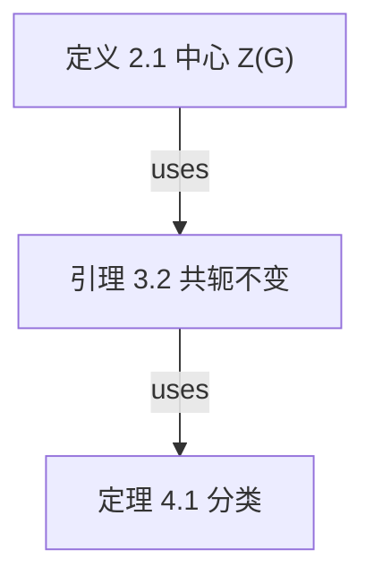

# OmniFlow — 万用流程图

一切「元素 + 关系」的结构都值得一张图。OmniFlow 不限领域：

| 场景 | 模板 | 关键边类型 |
| --- | --- | --- |
| 数学文章定理依赖 | `theorem-deps` | uses / depends-on / cites |
| 论文关联分析（跨论文） | `paper-map` | extends / cites / contradicts / generalizes |
| 项目任务分工 | `task-raci` | raci-r / raci-a / raci-c / raci-i / depends-on |
| 公司运营架构 | `org-structure` | reports-to |
| 科研项目合作 | `research-collab` | flow / raci-r / depends-on |
| 对话关联分析 | `conversation-map` | follows / answers / merges |

## 接口：三层对等，全部标准

1. **MCP（agent 首选）**：`of mcp` 启动 stdio 服务，**37 个工具** = 全量能力。mcpServers 配置：`{"command": "of", "args": ["mcp"]}`。完整清单见 docs/API.md。
2. **HTTP JSON API**：`of studio --no-open` 后调 `http://127.0.0.1:4319/api/...`（27 端点 + SSE）。
3. **CLI**：见「核心命令」。

> 本 skill 与插件一体：安装插件时本 skill 已自动投放；调用本 skill 即等于在使用 OmniFlow，无需再单独调用插件。

---

# ⛔ 铁律：执行本 skill 的任何任务时必须遵守

1. **禁止跳步、禁止合并步骤**。SOP 里编号的每一步都是独立动作，必须逐一执行。两步并成一步 = 违规。
2. **禁止猜测参数**。节点 id 必须来自 `of_get_graph` 的真实返回；文件夹路径必须来自 `of_tree` 或用户原话。宁可多查一次，不许编造。
3. **每完成一个写操作（add/patch/move/set_note），必须用 `of_get_graph` 复核一次**：节点数/连线数/内容是否与预期一致。不一致 = 立即修复，不许带病继续。
4. **归档先查工作记录**（`~/.omni-flow/工作记录.txt` 或 `of_tree`）：用户指定过文件夹 → 必须原样使用，一个字都不许改；已有同主题文件夹 → 直接复用，绝不另建；确属新领域 → 新建语义化文件夹（如「数学/论文笔记」「项目/小猪账本」），并告知用户放到了哪里。
5. **任务结束时必须按「汇报模板」如实汇报存储位置与规模**（见文末），路径必须是 `of_*` 返回的真实值，禁止手写路径。

---

# SOP-A：从零建一张「定理依赖图」（完整示范，照此粒度执行）

以下每一步都是**必须执行**的独立动作。以「用户：帮我整理 某篇论文的定理依赖」为例。

**第 1 步 · 建图（含文件夹判定）**
用户没指定文件夹 → 按主题自建：

```json
of_create_graph {
  "name": "论文定理依赖示例",
  "template": "theorem-deps",
  "folder": "数学/论文笔记"
}
```

返回中必须记录：`id`（如 `论文定理依赖示例-a1b2`）、`storage.graph`（如 `/Users/you/.omni-flow/graphs/论文定理依赖示例-a1b2/graph.json`）、`folder`（`数学/论文笔记`）、`nodes`/`edges` 数量。后续所有调用的 `id` 都用它，**禁止手写猜测**。

**第 2 步 · 读图确认起点**
```json
of_get_graph { "id": "论文定理依赖示例-a1b2" }
```
核对：模板自带 6 个节点、5 条边都在；记下每个节点的 `id`（如 `def-sub`、`lem-1`）与 `label`。

**第 3 步 · （仅当需要）新增自定义类型**
比如要加「猜想」类型：

```json
of_patch_node_type { "id": "<图id>", "type": "conjecture", "label": "猜想", "labelEn": "Conjecture", "shape": "diamond", "fill": "#F97316", "border": "#EA580C", "textColor": "#431407", "icon": "?" }
```

✅ 校验：`of_get_graph` 返回的 `nodeTypes.conjecture` 存在且字段正确。

**第 4 步 · 逐个补节点**（模板没有的才加；每节点一次调用）

```json
of_add_node { "id": "<图id>", "label": "引理 3.6 商代数表示保持", "type": "lemma", "x": 80, "y": 380, "w": 190, "h": 64 }
```

✅ 校验：`of_get_graph` 后 `nodes.length` = 上一次 +1，且新节点 `label` 无误。**有多少个节点就调用多少次，不许用一个调用塞全部**。

**第 5 步 · 逐个填节点备注**（每个节点都必须有，一节点一次调用）
`content` 写完整 Markdown（首行=卡片摘要；论文必附 DOI/arXiv + 本地路径）：

```json
of_set_note { "id": "<图id>", "nodeId": "def-sub", "content": "定义 2.1（群 G 的中心 Z(G)）\nZ(G) = { z ∈ G | ∀g∈G, zg=gz }\n- 记号: 本文所有中心元记 z_i\n- 直观解释: 与全体元素交换的元素集合" }
```

论文节点的 content 必须包含 DOI/arXiv 与本地文件路径（如 `- doi:10.1007/... | 本地: ~/Books/xxx.pdf`）。✅ 校验：`of_get_note` 回读一致。

**第 6 步 · 连线**（每条边一次调用）

```json
of_add_edge { "id": "<图id>", "source": "def-sub", "target": "lem-1", "type": "uses" }
```

✅ 校验：`of_get_graph` 的 `edges` 出现该边且 `source/target` 方向正确。

**第 7 步 · 修饰关键边**（可选但推荐：给边命名）

```json
of_patch_edge { "id": "<图id>", "edgeId": "<第6步返回的边id>", "patch": { "label": "归约到" } }
```

**第 8 步 · 自动布局**
```json
of_layout { "id": "<图id>" }
```

**第 9 步 · 校验**
```json
of_validate { "id": "<图id>" }
```
`issues` 非空 → 逐条修复后重跑，直到只剩 warnings。

**第 10 步 · 分析 + 汇报**
```json
of_analyze { "id": "<图id>" }
```
最后按文末「汇报模板」向用户汇报。**缺任何一步的校验记录 = 任务未完成**。

---

# SOP-B：批量建图（Mermaid 导入路线，节点 > 8 个时优先）

**第 1 步** · 按 OmniFlow 边类型写 Mermaid（`-->|uses|` 里的标签必须是注册过的边类型）：



**第 2 步**：
```json
of_import_mermaid { "text": "<上面的完整 Mermaid>", "name": "论文定理依赖", "folder": "数学/论文笔记" }
```
✅ 记录返回的 `id` 与 `storage.graph`。

**第 3 步** · `of_get_graph` 核对节点数与边方向（Mermaid 的 A-->B 是 A 指向 B）。

**第 4 步** · 逐节点 `of_set_note`（同 SOP-A 第 5 步，不许跳过）。

**第 5 步** · `of_validate` → `of_analyze` → 汇报。

---

# SOP-C：修改现有图

**加一个节点 + 连线 + 备注**（完整三连，缺一不可）：
```json
of_add_node { "id": "<图id>", "label": "猜想 5.1 高阶表示扩张", "type": "conjecture", "x": 300, "y": 500 }
of_add_edge { "id": "<图id>", "source": "<新节点id>", "target": "thm-1", "type": "extends" }
of_set_note { "id": "<图id>", "nodeId": "<新节点id>", "content": "猜想 5.1 …（完整表述）" }
```
新节点 `id` 从 `of_add_node` 返回里取，**不许猜**。

**移动节点位置**：
```json
of_move_node { "id": "<图id>", "nodeId": "thm-1", "x": 420, "y": 520 }
```

**改样式**：
```json
of_patch_node { "id": "<图id>", "nodeId": "thm-1", "patch": { "fill": "#7C3AED", "border": "#6D28D9", "textColor": "#F5F3FF", "status": "doing" } }
```

**删节点**（连带边会被校验拦下，先删边再删点）：
```json
of_delete_edge { "id": "<图id>", "edgeId": "<边id>" }
of_delete_node { "id": "<图id>", "nodeId": "<节点id>" }
```

---

# SOP-D：文件夹树与工作记录（Obsidian 式管理）

- **看树**：`of_tree {}` → 返回 `folders`（全部文件夹路径）与 `assign`（图 → 文件夹）。
- **建文件夹**：`of_create_folder { "path": "项目/小猪账本" }`（自动补齐 `项目` 祖先）。
- **移动图**：`of_move_graph { "graphId": "<图id>", "folder": "项目/小猪账本" }`（folder 传 `""` 移回根目录）。

**工作记录（必须先读）**：每次树变更会自动刷新顶层 `~/.omni-flow/工作记录.txt`——简短记录「哪个图放在哪个文件夹」。agent **每次运行、每次建图前必须先读 `of_tree`（或直接读该文件）**，然后按以下决策链归档：

1. 用户指定过文件夹 → **原样使用，一字不改**。
2. 没指定 → 在工作记录/树中查找**同主题文件夹**：找到 → **直接复用现有文件夹**，绝不另建（例：已存在「数学」，新任务是数学论文 → 归档到「数学」，不是「数学 2」也不是新建）。
3. 确属新领域 → 新建语义化文件夹（如「物理/手性高次谐波」）并告知用户。
4. 禁止把所有图都堆在根目录；禁止凭空发明同义重复文件夹。

# 箭头方向铁律：永远是「来源 → 结果」

总原则：**箭头从「源」指向「果」**——时间在先、逻辑在先、提供方、原因、机制、上级 = source（起点）；时间在后、派生物、接收方、下级、结果、现象 = target（终点）。**任何图、任何领域都不许反向**（不许「结果指向来源」）。

| 场景 | source（起点） | target（终点） | 建议类型/标签 |
| --- | --- | --- | --- |
| 数学推导 | 引理/定义/命题（前提） | 定理（结论） | uses / depends-on |
| 文献引用 | 被引文献（思想来源） | 引用它的论文（成果） | cites |
| 继承扩展 | 奠基论文（旧） | 发展论文（新） | extends / generalizes |
| 因果 | 原因/机制 | 现象/结果 | flow「导致」 |
| 流程步骤 | 前一步 | 后一步 | flow |
| 汇聚 | 各来源分支 | 汇聚节点 | merges |
| 组织汇报 | 上级 | 下级 | reports-to |
| RACI 职责 | 角色 | 任务 | raci-r / raci-a / raci-c / raci-i |
| 资源/数据流 | 提供方 | 接收方 | flow「输入/资助」 |
| 反驳/矛盾 | 反驳方（行为主体） | 被反驳方（客体） | contradicts（唯一「动作方向」例外） |
| 对称相互作用 | A | B | 任意类型 + arrow="both" |

**自检口诀**：把箭头读成「A 产生/支撑/导致/授权 B」——读得通就对了；若只能读成「B 产生 A」，就是画反了。

**正例（论文依赖图标准写法）**：
```
[31] Uzan 2024 Nature 626,66 --cites--> 偶次谐波来自带间 Berry 相积累   ← 文献指向结论 ✓
引理 3.2 --uses--> 定理 4.1                                          ← 前提指向结论 ✓
```
**反例（画反了，出现即全部翻转重连）**：
```
偶次谐波… --cites--> [31]      ← 结论指向文献 ✗
定理 4.1 --depends-on--> 引理 3.2   ← 结果指向前提 ✗
```

---

# 布局模式

- `of_layout { "id": "<图id>" }` —— 按依赖分层（默认）。
- `of_layout { "id": "<图id>", "mode": "clusters" }` —— **按分组聚簇**：同组成员空间聚在一起，各组区域从左到右排布；有分组的图整理布局一律用此模式，否则分层布局会打散聚簇。
- Studio：点「⌗ 一键整理」→ 弹出两种模式选择。

# SOP-F：分组（按功能聚簇）

分组 = 给同一张图内的相关节点加彩色容器（Studio 中整组拖动、组列表点击定位）：

```json
of_add_group { "id": "<图id>", "label": "主定理证明核心", "members": ["lem-1", "prop-1", "thm-1"] }
of_delete_group { "id": "<图id>", "groupId": "<组id>" }
```

- 分组原则：按**功能聚簇**——证明核心、实验测量、数值模拟各一组；组名用业务语言（如「主定理证明核心」「实验测量组」）。
- 分组信息存在 `graph.json` 的 `groups` 数组，可 `of_patch_graph_meta` 之外直接读改。

**分组样板（按功能聚簇，照此粒度执行）**：一张论文依赖图的标准分四组——每类一个颜色、组成员按功能归属：

| 组 | 颜色 | 成员归属 |
| --- | --- | --- |
| 核心结论链 / Pipeline | `#2563EB` | 模型与主定理节点（式(1)(2)(3)、主结论） |
| 理论机制 / Mechanism | `#7C3AED` | 原理与机制引理节点 |
| 开放问题与展望 / Outlook | `#D97706` | 推广、路线图、应用节点 |
| 关键文献 / Key references | `#059669` | 全部文献节点（可再按主题拆 2–3 组） |

执行（每组一次调用，members 用 `of_get_graph` 返回的真实 id）：

```json
of_add_group { "id": "<图id>", "label": "核心结论链", "color": "#2563EB", "members": ["<模型节点id>", "<主定理id>"] }
of_add_group { "id": "<图id>", "label": "关键文献", "color": "#059669", "members": ["<文献节点id>", "..."] }
```

✅ 校验：`of_get_graph` 的 `groups` 数组包含全部组且 members 数正确。Studio 中：组框整体拖动、检查器组列表点击定位。

---

# 存储位置一览（agent 汇报与找文件必读）

| 内容 | 路径 |
| --- | --- |
| 存储根 | macOS/Linux `~/.omni-flow/`；Windows 自动选第一个非系统盘（如 `D:\OmniFlow`） |
| 图数据 | `<根>/graphs/<图id>/graph.json`（唯一事实源） |
| 节点备注 | `<根>/graphs/<图id>/notes/<节点id>.md` |
| 自定义模板 | `<根>/templates/<模板id>.json` |
| 文件夹树 | `<根>/tree.json` |
| **工作记录** | `<根>/工作记录.txt`（图 → 文件夹台账，agent 归档决策依据） |
| 回收站 | `<根>/trash/` |

---

# SOP-E：沉淀与复用自定义模板

```json
of_save_template { "fromGraph": "<图id>", "templateId": "my-w-algebra-tpl", "name": "我的定理依赖模板", "desc": "含完整备注骨架" }
```
✅ 记录返回的 `templatePath`（如 `~/.omni-flow/templates/my-w-algebra-tpl.json`）。

复用：`of_create_graph { "name": "新论文", "template": "my-w-algebra-tpl", "folder": "数学/新论文" }`。

---

# 节点备注（notes/<nodeId>.md）内容规范：短而密

≤30 行、首行一句话摘要（显示在卡片上）、可核查标识必附。按类型：

| 类型 | .md 里写什么 |
| --- | --- |
| 定理/引理/命题 | 完整表述、**公式本体（文本数学，如 Ex/Ey = Mθ·diag(rx·e^{−iδα}, ry)·(ax,ay)）**、证明思路、依赖引理清单、反例边界。**禁止只写「见式(1)」「详见正文」**——公式必须抄进备注 |
| 定义 | 严格定义、记号、直观解释 |
| 论文/书目 | **DOI 或 arXiv id 必附**；本地 PDF 附绝对路径或 file:// 链接；关键结果；与本图关系 |
| 人员 | 一句话身份、研究方向、职责、CV/主页链接（本地文件附路径） |
| 任务 | 验收标准、上下文、产出物路径 |
| 部门/团队 | 职责范围、编制、汇报说明 |
| 会话/话题 | 结论纪要、待办、关联会话 |

**反例（不合格，太敷衍）**：
```
论文笔记，见原文。
```
```
主结论：庞加莱球覆盖（详见正文）。
```

**正例（合格：公式本体 + 机制细节 + 双语）**：
```
式(1) Jones 相移器模型 / Eq. (1) Jones retarder model
【中文】Ex/Ey = Mθ · diag(rx·e^{−iδαorth}, ry) · (ax, ay)
- Mθ：含修正镜面反射对称的实投影矩阵；中心 = 有效相位延迟器 Jones 矩阵
- δαorth = αx_cv − αy_cv：跃迁偶极相位各向异性之半周期差 → 支配手性与椭偏
- rx = sin(γ̄B + ᾱorth)、ry = sin γ̄B：周期平均带间 Berry 相与偶极相位耦合
- 预言偏振主轴 Ψ = 3θ − (2n+1)π/2，与 Fig.2(b) 吻合
【English】Identical formulas; Ψ = 3θ − (2n+1)π/2 agrees with Fig. 2(b).
- 依据: [26][28][29]（复偶极矩）、[35]（Bi2Se3 C3v）
```

**详尽度自检（强制，每次 of_set_note 后执行）**：
1. `of_get_note` 回读全文；
2. 检查：行数 ≥ 8；**定理/模型/公式类节点必须含文本数学公式本体**；论文节点含 DOI/arXiv + 本地路径；
3. 用户要求英文、或界面为英文 → **必须提供全英文版本**（中英并列或英文独立成段）；
4. 任一条不满足 → 重写 → 再次回读校验。**回读不通过就不许进入下一步**。

**正例（合格）**：
```
Nilpotent Orbits in Semisimple Lie Algebras
- doi:10.1007/978-1-4612-0881-2 | 本地: ~/Books/nilpotent-orbits.pdf
- 关键结果: 幂零轨道分类与闭轨道偏序
- 与本图关系: 定理 4.1 的工具书
```

---

# 汇报模板（每次图相关任务结束时必须逐项输出）

```
✅ 已完成：<一句话任务描述>
📁 存储位置：<of_* 返回的 storage.graph 完整路径>
   备注目录：<storage.notesDir>
🗂 所在文件夹：<folder>（用户指定 / agent 自建）
📊 规模：节点 N 个 · 连线 M 条 · 分组 K 个
🔍 校验：<issues 条数> 个错误 / <warnings 条数> 个警告（如有，列出）
💡 分析结论：<环/瓶颈/闭包的关键发现（如做过分析）>
```

---

# 核心命令（CLI 速查）

```bash
of templates                          # 全部模板
of create "XX论文定理依赖" --template theorem-deps
of list && of read <id>               # graph.json 是唯一事实源
of validate <id>                      # 硬错误阻断；环/孤立点只是警告
of analyze <id> [--trace <nodeId>]    # 环 + 度中心性瓶颈 + 上/下游闭包
of layout <id>                        # 分层自动布局
of export <id> --format mermaid|dot|md|json --out 文件
of import 图.mmd                      # Mermaid / JSON
of import-af <agent-flow-id>          # agent-flow 工作流转图
of studio [--no-open]                 # 画布 http://127.0.0.1:4319
of tree                               # 文件夹树
```


# 踩坑经验（Lessons learned，实战验证）

1. **id 永远来自返回值**：of_add_node / of_add_edge 会自生成 id（n-xxxx/e-xxxx），脚本必须先建「label → 真实 id」映射再引用，禁止拼凑或猜测 id。
2. **备注写完必须回读**：of_set_note 后 of_get_note 校验行数/公式/双语，不达标重写——敷衍备注（"详见正文"）会被用户当场打回。
3. **方向先想后连**：先判断「谁是源谁是果」，再调用 of_add_edge；建完跑一遍 of_analyze 检查方向语义。
4. **归档先查工作记录**：已有同主题文件夹直接复用，新领域才新建，用户指定永远优先。
5. **有分组的图整理布局用 clusters 模式**：layered 会把空间聚簇打散。
6. **双保险验证**：每次写库/推送后用读回接口或 contents sha 比对确认，绝不凭返回 200 就认定成功（空串比较会造出假阳性）。
7. **长模板/带 ${} 的代码**：用整文件写入（Write）处理，不要用行内正则替换（${...} 会被吞）。
