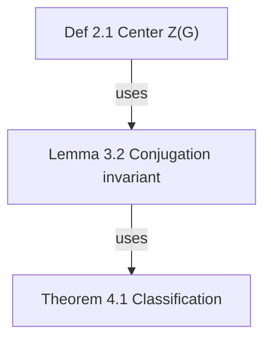

# OmniFlow — Universal Flow Map

Every "elements + relations" structure deserves a map. OmniFlow is domain-agnostic:

| Scenario | Template | Key edge types |
| --- | --- | --- |
| Math paper theorem deps | `theorem-deps` | uses / depends-on / cites |
| Cross-paper relations | `paper-map` | extends / cites / contradicts / generalizes |
| Project task RACI | `task-raci` | raci-r / raci-a / raci-c / raci-i / depends-on |
| Company org structure | `org-structure` | reports-to |
| Research collaboration | `research-collab` | flow / raci-r / depends-on |
| Conversation mapping | `conversation-map` | follows / answers / merges |

## Language Rules for Graph Creation

When creating a new flow graph, determine the label language by this priority:

1. **User's language** — if the user communicates in Chinese → `lang: "zh"`; if English → `lang: "en"`.
2. **Source content language** — if mapping an article/paper/notes, match the source document's language.
3. **Default: English** — if neither is determinable, omit `lang` (defaults to `en`).

Pass it explicitly: `of_create_graph { "name": "...", "template": "theorem-deps", "lang": "zh" }`

- The Studio canvas passes the UI language automatically; CLI uses `of create "name" --template X --lang zh|en`.
- Never mix languages within a single graph. Node labels, group labels, edge labels, and notes must all use the same language.
- Notes must be written in the graph's language (English graph → English notes).

## Interfaces: three equal layers

1. **MCP (agent's first choice)**: `of mcp` starts a stdio server with **37 tools** = full capability. mcpServers config: `{"command": "of", "args": ["mcp"]}`. Full list in docs/API.md.
2. **HTTP JSON API**: `of studio --no-open` then call `http://127.0.0.1:4319/api/...` (27 endpoints + SSE).
3. **CLI**: see "Core Commands" section.

> This skill and the plugin are one unit: installing the plugin auto-deploys this skill; invoking this skill IS using OmniFlow.

---

# ⛔ Iron Rules: must follow for ANY task using this skill

1. **No skipping, no merging steps**. Every numbered step in an SOP is a separate action. Combining two steps = violation.
2. **Never guess parameters**. Node IDs must come from `of_get_graph`'s actual return; folder paths must come from `of_tree` or the user's exact words. Look up one more time rather than fabricate.
3. **After every write operation (add/patch/move/set_note), verify with `of_get_graph`**: node count/edge count/content matches expectations. Mismatch = fix immediately, never proceed with errors.
4. **Check the work log before filing** (`~/.omni-flow/WORKLOG.txt` or `of_tree`): user-specified folder → use exactly as given; existing same-topic folder → reuse it, never create a parallel one; genuinely new domain → create a semantic folder and inform the user.
5. **At task end, report storage location and scale using the Report Template** (see bottom). Paths must be actual `of_*` return values, never hand-written.

---

# SOP-A: Create a "theorem dependency graph" from scratch (full walkthrough)

Every step below is a **required, independent** action. Example: "User: help me map the theorem dependencies of a paper."

**Step 1 · Create graph (with folder determination)**

```json
of_create_graph {
  "name": "Paper theorem deps",
  "template": "theorem-deps",
  "folder": "Math/paper-notes"
}
```

Record from the return: `id`, `storage.graph`, `folder`, `nodes`/`edges` counts. Use this `id` for all subsequent calls — **never hand-write or guess**.

**Step 2 · Read graph to confirm starting point**
```json
of_get_graph { "id": "<graph-id>" }
```
Verify: template's 6 nodes and 5 edges are present; note each node's `id` and `label`.

**Step 3 · (Only if needed) Add custom node type**
```json
of_patch_node_type { "id": "<graph-id>", "type": "conjecture", "label": "Conjecture", "labelEn": "Conjecture", "shape": "diamond", "fill": "#F97316", "border": "#EA580C", "textColor": "#431407", "icon": "?" }
```
✅ Verify: `of_get_graph` returns `nodeTypes.conjecture` with correct fields.

**Step 4 · Add nodes one by one** (only ones not in template; one call per node)
```json
of_add_node { "id": "<graph-id>", "label": "Lemma 3.6 quotient algebra representation", "type": "lemma", "x": 80, "y": 380, "w": 190, "h": 64 }
```
✅ Verify: `nodes.length` = previous + 1, new node `label` correct. **One call per node — never bulk-insert**.

**Step 5 · Fill node notes** (every node must have one; one call per node)
`content` is full Markdown (first line = card summary; papers must include DOI/arXiv + local path):
```json
of_set_note { "id": "<graph-id>", "nodeId": "def-sub", "content": "Def 2.1 (Center Z(G) of group G)\nZ(G) = { z ∈ G | ∀g∈G, zg=gz }\n- Notation: all central elements as z_i\n- Intuition: elements commuting with everything" }
```
✅ Verify: `of_get_note` readback matches.

**Step 6 · Connect edges** (one call per edge)
```json
of_add_edge { "id": "<graph-id>", "source": "def-sub", "target": "lem-1", "type": "uses" }
```
✅ Verify: `edges` contains the edge with correct `source/target` direction.

**Step 7 · Label key edges** (optional but recommended)
```json
of_patch_edge { "id": "<graph-id>", "edgeId": "<edge-id-from-step-6>", "patch": { "label": "reduces to" } }
```

**Step 8 · Auto layout**
```json
of_layout { "id": "<graph-id>" }
```

**Step 9 · Validate**
```json
of_validate { "id": "<graph-id>" }
```
Non-empty `issues` → fix each → re-run until only warnings remain.

**Step 10 · Analyze + Report**
```json
of_analyze { "id": "<graph-id>" }
```
Report using the template at the bottom. **Missing any step's verification record = task incomplete**.

---

# SOP-B: Bulk graph creation (Mermaid import route, prefer for >8 nodes)

**Step 1** · Write Mermaid with OmniFlow edge types (labels in `-->|uses|` must be registered types):


**Step 2**:
```json
of_import_mermaid { "text": "<full mermaid above>", "name": "Paper theorem deps", "folder": "Math/paper-notes" }
```
✅ Record returned `id` and `storage.graph`.

**Step 3** · `of_get_graph` to verify node count and edge directions.

**Step 4** · Per-node `of_set_note` (same as SOP-A Step 5, don't skip).

**Step 5** · `of_validate` → `of_analyze` → Report.

---

# SOP-C: Modify an existing graph

**Add node + edge + note** (all three, no skipping):
```json
of_add_node { "id": "<graph-id>", "label": "Conjecture 5.1 Higher rep extension", "type": "conjecture", "x": 300, "y": 500 }
of_add_edge { "id": "<graph-id>", "source": "<new-node-id>", "target": "thm-1", "type": "extends" }
of_set_note { "id": "<graph-id>", "nodeId": "<new-node-id>", "content": "Conjecture 5.1 …" }
```
New node's `id` comes from `of_add_node` return — **never guess**.

**Move node**: `of_move_node { "id": "<graph-id>", "nodeId": "thm-1", "x": 420, "y": 520 }`

**Style patch**: `of_patch_node { "id": "<graph-id>", "nodeId": "thm-1", "patch": { "fill": "#7C3AED", "border": "#6D28D9", "status": "doing" } }`

**Delete** (edges first, then node):
```json
of_delete_edge { "id": "<graph-id>", "edgeId": "<edge-id>" }
of_delete_node { "id": "<graph-id>", "nodeId": "<node-id>" }
```

---

# SOP-D: Folder tree & work log (Obsidian-style management)

- **View tree**: `of_tree {}` → returns `folders` and `assign` (graph → folder).
- **Create folder**: `of_create_folder { "path": "Projects/my-project" }` (auto-creates ancestors).
- **Move graph**: `of_move_graph { "graphId": "<graph-id>", "folder": "Projects/my-project" }` (empty folder `""` = move to root).

**Work log (must read first)**: Every tree change auto-updates `~/.omni-flow/WORKLOG.txt` — maps graph → folder. Agents **must read `of_tree` (or the file) before every run and before creating any graph**, then follow this decision chain:

1. User specified a folder → **use exactly as given**.
2. Not specified → search WORKLOG/tree for a **same-topic folder**: found → **reuse it**, never create a parallel one.
3. Genuinely new domain → create a semantic folder and inform the user.
4. Never dump all graphs in root; never invent duplicate folders.

---

# Arrow Direction Iron Rule: always "source → result"

**Arrows point from "source" to "result"** — earlier in time/logic, provider, cause, mechanism, superior = source; later, derived, receiver, subordinate, result = target. **Never reverse in any domain.**

| Scenario | source | target | Suggested type |
| --- | --- | --- | --- |
| Math derivation | Lemma/Def/Prop (premise) | Theorem (conclusion) | uses / depends-on |
| Citation | Cited paper (idea source) | Citing paper (result) | cites |
| Extension | Founding paper (old) | Follow-up (new) | extends / generalizes |
| Causation | Cause/mechanism | Phenomenon/result | flow |
| Process step | Previous step | Next step | flow |
| Convergence | Source branches | Merge node | merges |
| Org reporting | Superior | Subordinate | reports-to |
| RACI | Role | Task | raci-r / raci-a / raci-c / raci-i |
| Resource/data flow | Provider | Receiver | flow |
| Contradiction | Contradicting party | Contradicted party | contradicts |
| Symmetric | A | B | any type + arrow="both" |

**Self-check**: Read the arrow as "A produces/supports/causes/authorizes B" — if it reads naturally, correct; if only "B produces A" makes sense, it's reversed.

**Positive examples**:
```
[Ref 31] --cites--> Even harmonics arise from interband Berry phase    ← ref points to conclusion ✓
Lemma 3.2 --uses--> Theorem 4.1                                       ← premise points to conclusion ✓
```
**Negative examples** (reverse immediately if found):
```
Even harmonics… --cites--> [Ref 31]      ← conclusion points to ref ✗
Theorem 4.1 --depends-on--> Lemma 3.2    ← result points to premise ✗
```

---

# Layout modes

- `of_layout { "id": "<graph-id>" }` — layered by dependency (default).
- `of_layout { "id": "<graph-id>", "mode": "clusters" }` — **cluster by groups**: same-group nodes are spatially clustered, group regions laid left-to-right. Use this for graphs with groups; layered layout will destroy spatial clusters.
- Studio: click "⌗ Tidy up" → choose mode.

# SOP-F: Grouping (functional clustering)

Groups = colored containers for related nodes (Studio: drag whole group, click group in inspector to locate):

```json
of_add_group { "id": "<graph-id>", "label": "Core proof chain", "color": "#2563EB", "members": ["lem-1", "prop-1", "thm-1"] }
of_delete_group { "id": "<graph-id>", "groupId": "<group-id>" }
```

- **Principle**: cluster by function — proof core, experimental measurements, numerical simulation each in one group; group names in business language.
- Group data stored in `graph.json` `groups` array.

**Standard 4-group template** (one color per category):

| Group | Color | Member assignment |
| --- | --- | --- |
| Core conclusions / Pipeline | `#2563EB` | Model + main theorem nodes |
| Mechanism / Theory | `#7C3AED` | Principle and mechanism lemma nodes |
| Open problems / Outlook | `#D97706` | Extensions, roadmap, application nodes |
| Key references | `#059669` | All paper nodes (split 2–3 by topic if many) |

✅ Verify: `of_get_graph` `groups` contains all groups with correct member counts.

---

# Storage paths (for agent reporting and file lookup)

| Content | Path |
| --- | --- |
| Storage root | macOS/Linux `~/.omni-flow/`; Windows auto-selects first non-system drive |
| Graph data | `<root>/graphs/<graph-id>/graph.json` (single source of truth) |
| Node notes | `<root>/graphs/<graph-id>/notes/<node-id>.md` |
| Custom templates | `<root>/templates/<template-id>.json` |
| Folder tree | `<root>/tree.json` |
| **Work log** | `<root>/WORKLOG.txt` (graph → folder ledger, agent filing reference) |
| Trash | `<root>/trash/` |

---

# SOP-E: Save & reuse custom templates

```json
of_save_template { "fromGraph": "<graph-id>", "templateId": "my-template", "name": "My theorem deps template", "desc": "With full note skeleton" }
```
✅ Record returned `templatePath`.

Reuse: `of_create_graph { "name": "New paper", "template": "my-template", "folder": "Math/new-paper" }`.

---

# Node note content standards (notes/<nodeId>.md): short and dense

≤30 lines, first line = one-sentence summary (shown on card), verifiable identifiers required. By type:

| Type | What to write in .md |
| --- | --- |
| Theorem/Lemma/Prop | Full statement, **formula body (text math)**, proof idea, dependency list, counterexample boundaries. **Never write "see Eq. (1)" or "see paper" — copy the formula into the note** |
| Definition | Strict definition, notation, intuition |
| Paper/Bibliography | **DOI or arXiv id required**; local PDF absolute path; key results; relation to this graph |
| Person | Identity, research area, role, CV/homepage link |
| Task | Acceptance criteria, context, deliverable path |
| Department/Team | Scope, headcount, reporting structure |
| Session/Topic | Conclusions, TODOs, related sessions |

**Negative example (unacceptable — too lazy)**:
```
Paper notes, see original text.
```

**Positive example (good: formula body + mechanism detail)**:
```
Nilpotent Orbits in Semisimple Lie Algebras
- doi:10.1007/978-1-4612-0881-2 | Local: ~/Books/nilpotent-orbits.pdf
- Key result: Nilpotent orbit classification and closed orbit partial order
- Relation to this graph: Reference for Theorem 4.1
```

**Completeness self-check (mandatory, after every of_set_note)**:
1. `of_get_note` readback full text;
2. Check: line count ≥ 8; **theorem/model/formula nodes must contain text math formula body**; paper nodes have DOI/arXiv + local path;
3. Any criterion unmet → rewrite → re-verify. **Cannot proceed until readback passes**.

---

# Report Template (output at end of every graph-related task)

```
✅ Done: <one-line task description>
📁 Storage: <storage.graph full path from of_* return>
   Notes dir: <storage.notesDir>
🗂 Folder: <folder> (user-specified / agent-created)
📊 Scale: N nodes · M edges · K groups
🔍 Validation: <issues count> errors / <warnings count> warnings (list if any)
💡 Analysis: <key findings from cycle/bottleneck/closure (if done)>
```

---

# Core Commands (CLI reference)

```bash
of templates                          # all templates
of create "Paper theorem deps" --template theorem-deps
of list && of read <id>               # graph.json is single source of truth
of validate <id>                      # hard errors block; cycles/orphans are warnings
of analyze <id> [--trace <nodeId>]    # cycles + degree centrality + up/downstream closure
of layout <id> [--mode layered|clusters]
of export <id> --format mermaid|dot|md|json --out file
of import file.mmd                    # Mermaid / JSON
of import-af <agent-flow-id>          # agent-flow workflows
of studio [--no-open]                 # canvas http://127.0.0.1:4319
of tree                               # folder tree
```

# Lessons learned (battle-tested)

1. **IDs always come from return values**: of_add_node / of_add_edge auto-generate IDs (n-xxxx/e-xxxx). Scripts must build a "label → real ID" map before referencing; never fabricate or guess IDs.
2. **Always read back notes**: after of_set_note, use of_get_note to verify line count/formulas/bilingual content. Lazy notes ("see paper") will be rejected by users.
3. **Direction before connection**: determine "who is source, who is result" before calling of_add_edge; run of_analyze after to verify direction semantics.
4. **Check work log before filing**: reuse existing same-topic folders; create new only when genuinely new domain; user-specified paths always win.
5. **Use clusters mode for grouped graphs**: layered layout destroys spatial clusters.
6. **Double verification**: after every write/push, use readback API or contents sha comparison to confirm. Never trust a 200 return alone (empty-string comparisons create false positives).
7. **Long templates / code with ${}**: use full-file write (Write tool), never inline regex replacement (${...} gets eaten).
8. **If a graph disappears, check the server first — never delete files**: storage has corruption self-healing (trailing-junk repair on read + last 3 `.bak` snapshots). Before assuming data loss, confirm `of studio` is running the latest code (a stale process holds old code); do not manually delete graph directories.
