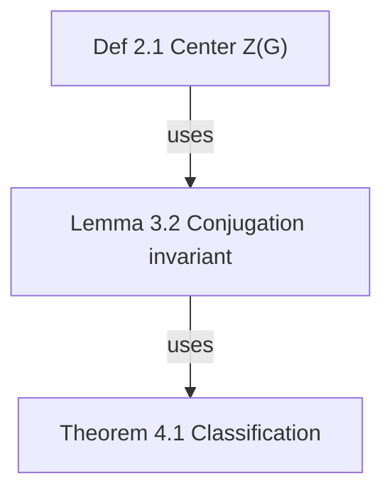

# ⛔ 强制红线（MUST · 违反即视为任务失败）

> 以下每条都是**实际踩过的坑**，不是建议。任何一条被违反，产物在浏览器里一定出问题。

## R0. 任务开始时的合规声明（MUST · 每次都要做）

动手前**MUST**完成三件事，并在首条回复里明确写出：

1. **已通读 R1–R8 与「📕 失败案例库」**（是"已读"，不是"将读"）。
2. **写出本次验证计划**：要跑哪些测试、怎么核对（例：`smoke` + `mcp-test` + 浏览器实测 + `.bak` 前后节点/边计数）。
3. **声明红线状态**：若某条红线客观上无法满足（例如用户明确要求跳过验证），**MUST**先停止并说明冲突、由用户裁决；**MUST NOT** 静默降级，也**MUST NOT**"先做了再补"。

> **违规处理**：一旦发现违反 R0–R8 中任何一条，**MUST**立刻回滚该次改动，在回复中明示违反项与原因，然后按正确流程重做；**MUST NOT** 把违规产物当"已完成"交付。

## R1. 公式：只用 KaTeX 标准命令，写完必须自检

- **MUST** 在写入任何含公式的内容（备注/卡片标题/连线标签）前后调用 **`of_latex_check`**；`failed` 非空即**不得提交**，按 `hint` 修正后重查。
- **MUST NOT** 使用 `\newcommand` 自造宏。合法集合 = KaTeX 内置 + 官方 `mhchem` 的 `\ce{}`。
- **MUST** 用 `$$…$$` 包裹需要 `\tag{...}`、`aligned`、矩阵的公式（`\tag` 在行内 `$…$` 非法；系统会自动转文本编号，但不要依赖它兜底）。
- **MUST** 保证花括号/`\left\right`/括号配对（未闭合会让**整段**编译失败）。
- **MUST NOT** 在公式内写嵌套 `$`；中文要放进 `\text{…}`。
- 需要**展示 LaTeX 源码本身**时，**MUST** 放进代码围栏 ```` ```…``` ````（围栏内容不参与校验）。
- 系统防线：`writeNodeNote` 与所有图级写入（MCP `mutateGraph`、Web `mutateGraph`、`of_import_doc`）会**自动规范化**并**硬校验**——不通过的写入会被**拒绝**并返回逐条修法。这不是提示，是拦截。

## R2. 语义 id：跨图链接的对齐前提

- 卡片 id **MUST** 采用 `{类型缩写}-{节}.{序号}`（`thm-2.1.1` / `def-2.3.4` / `eq-2.1.2`）；解析导入时自动生成，**不要手改**。
- 缩写固定：`thm def prop lem cor ex rem eq`（`paper→ref`）。
- 跨图链接的 `why` **MUST** 写清数学依据（不是"内容相关"）。

## R3. 写入前必须自检的三件事

1. `of_latex_check` 全绿（见 R1）。
2. **不要用空/退化数据覆盖已有内容**：任何"整图写入"都不得在目标图非空时写入空图（服务端已有护栏，但**不要试探**）。
3. 结构性改动后 `of_validate` 应通过（环是警告不是错误，允许）。

## R4. 改前端后必须走完「四步验证」（少一步就等于没改）

> 现象：改了源码、`node --check` 通过、测试全绿，但浏览器行为没变。原因：`install.sh` 因 PATH 无 `node` 而**静默失败**，`~/.omni-flow` 里一直是旧副本。

```bash
export PATH="/Users/andylyu/.workbuddy/binaries/node/versions/22.22.2-3/bin:$PATH"
bash install.sh                                               # ① 安装（已加固：自动定位 node）
grep -c "<本次改动的关键标识>" ~/.omni-flow/studio/index.html  # ② 校验安装副本
# ③ 只有改了 lib/*.mjs 或 studio/server.mjs 才需要重启 studio
# ④ 浏览器带 ?v=<时间戳> 复核（强行绕过浏览器缓存）
```

- **MUST** 每步都做；**MUST NOT** 用 `install.sh > /dev/null` 掩盖失败。
- **MUST** 第 ② 步 grep 计数 **> 0**；等于 0 就是安装副本仍是旧的，**禁止继续**，先排查。
- **MUST**：改了 `lib/*.mjs` 或 `studio/server.mjs` → **重启 studio**；只改 `studio/index.html` → 无需重启（服务端每请求读盘），但浏览器**必须**带 `?v=`。
- **MUST** 在交付报告里贴出第 ② 步的**真实数字**与浏览器实测输出（DOM 数量/类名/坐标），**MUST NOT** 只写"应该好了"。
- **MUST** 改完 skill 本身后同样跑 `bash install.sh`（skill 以软链装入 `~/.workbuddy`、`~/.zcode`、`~/.claude`、`~/.codex`）。

## R5. 不要写重复的顶层声明

- `function foo(){}` 定义两次时**后者静默覆盖前者**，且无任何报错。本项目因此丢过功能（`renderDepList` 被旧版覆盖 → 上下游列表不显示）。
- **MUST** 依赖 `node test/smoke.mjs` 的「无重复顶层声明」检查（已内置）。

## R6. 取 DOM 元素：`getElementById` 不能吃 CSS 转义

- `$("node-" + CSS.escape(id))` 是**错的**（`$` = `getElementById`）；含 `.` 的语义 id（`def-2.1.1`）会被转义成 `def-2\.1\.1` → 取不到元素。
- **MUST** 用 `nodeEl(id)`（优先 `nodesLayer._map`，回退原始 id）；`CSS.escape` 只配 `querySelector`。

## R7. 可选链与默认值

- 新字段一律给默认值（`node.attachments ?? []`）；`normalizeGraph` **只保留白名单字段**，新增字段必须同步加进白名单，否则存盘即丢（`conversation`/`attachments`/`rect` 都踩过）。

## R8. 备份优先

- 任何"整图替换/清空/批量删除"前，**MUST** 先确认 `.bak/` 可用（本项目靠它从一次清空中恢复过 71 节点）。
- **MUST NOT** 递归删除 `~/.omni-flow`、`Studio` 数据目录或个人目录。

# OmniFlow — Universal Flow Map

Every "elements + relations" structure deserves a map. OmniFlow is domain-agnostic:

| Scenario | Template | Key edge types |
| --- | --- | --- |
| Math paper theorem deps | `theorem-deps` | uses / depends-on / cites |
| Cross-paper relations | `paper-map` | extends / cites / contradicts / generalizes |
| Project task RACI | `task-raci` | raci-r / raci-a / raci-c / raci-i / depends-on |
| Company org structure | `org-structure` | reports-to |
| Research collaboration | `research-collab` | flow / raci-r / depends-on |
| Conversation mapping | `conversation-map` | follows / answers / merges |

## Language Rules for Graph Creation

When creating a new flow graph, determine the label language by this priority:

1. **User's language** — if the user communicates in Chinese → `lang: "zh"`; if English → `lang: "en"`.
2. **Source content language** — if mapping an article/paper/notes, match the source document's language.
3. **Default: English** — if neither is determinable, omit `lang` (defaults to `en`).

Pass it explicitly: `of_create_graph { "name": "...", "template": "theorem-deps", "lang": "zh" }`

- The Studio canvas passes the UI language automatically; CLI uses `of create "name" --template X --lang zh|en`.
- Never mix languages within a single graph. Node labels, group labels, edge labels, and notes must all use the same language.
- Notes must be written in the graph's language (English graph → English notes).

## Interfaces: three equal layers

1. **MCP (agent's first choice)**: `of mcp` starts a stdio server with **61 tools** = full capability. mcpServers config: `{"command": "of", "args": ["mcp"]}`. Full list in docs/API.md.
2. **HTTP JSON API**: `of studio --no-open` then call `http://127.0.0.1:4319/api/...` (50+ endpoints + SSE).
3. **CLI**: see "Core Commands" section.

> This skill and the plugin are one unit: installing the plugin auto-deploys this skill; invoking this skill IS using OmniFlow.

---

# ⛔ Iron Rules: MUST follow for ANY task using this skill

> 中文对照见顶部「强制红线 R0–R8」。本节与其**同等强制**：违反任一条 = 任务失败（不是"瑕疵"）。
> **执行前先声明合规**（R0），**交付前先跑验证协议**（文末「✅ 交付前验证协议」）。

1. **No skipping, no merging steps** — every numbered step in an SOP is a separate action. Combining two steps = violation. 禁止跳步、禁止合并步骤。
2. **Never guess parameters** — node IDs must come from `of_get_graph`'s actual return; folder paths must come from `of_tree` or the user's exact words. Look up one more time rather than fabricate. 禁止臆造 id / 路径。
3. **After every write (add/patch/move/set_note/replace), verify with `of_get_graph` or `of_get_note`** — node count, edge count and content must match expectations. Mismatch = fix immediately; never proceed on top of an error. 写入后必须读回核对。
4. **Check the work log before filing** (`~/.omni-flow/WORKLOG.txt` or `of_tree`): user-specified folder → use exactly as given; existing same-topic folder → reuse it, never create a parallel one; genuinely new domain → create a semantic folder and inform the user.
5. **Formula content is gated by `of_latex_check`** (see R1) — `failed` non-empty means you MUST NOT commit; fix per `hint` and re-check. 公式未通过校验不得写入。
6. **Any image/PDF/LaTeX source dropped in by the user MUST be processed to the end** (unpack → understand → implement or map), never summarised away or left half-done. 用户给的材料必须处理到底。
7. **Never destroy data**: before any bulk replace / clear / batch delete, confirm `.bak/` exists and record before/after node & edge counts (see R8). 禁止任何形式的数据破坏。
8. **At task end, report using the Report Template** (see bottom) with the full verification-protocol output. Paths must be actual `of_*` return values, never hand-written. 结尾必须按模板报告，并附真实验证输出。

---

# SOP-A: Create a "theorem dependency graph" from scratch (full walkthrough)

Every step below is a **required, independent** action. Example: "User: help me map the theorem dependencies of a paper."

**Step 1 · Create graph (with folder determination)**

```json
of_create_graph {
  "name": "Paper theorem deps",
  "template": "theorem-deps",
  "folder": "Math/paper-notes"
}
```

Record from the return: `id`, `storage.graph`, `folder`, `nodes`/`edges` counts. Use this `id` for all subsequent calls — **never hand-write or guess**.

**Step 2 · Read graph to confirm starting point**
```json
of_get_graph { "id": "<graph-id>" }
```
Verify: template's 6 nodes and 5 edges are present; note each node's `id` and `label`.

**Step 3 · (Only if needed) Add custom node type**
```json
of_patch_node_type { "id": "<graph-id>", "type": "conjecture", "label": "Conjecture", "labelEn": "Conjecture", "shape": "diamond", "fill": "#F97316", "border": "#EA580C", "textColor": "#431407", "icon": "?" }
```
✅ Verify: `of_get_graph` returns `nodeTypes.conjecture` with correct fields.

**Step 4 · Add nodes one by one** (only ones not in template; one call per node)
```json
of_add_node { "id": "<graph-id>", "label": "Lemma 3.6 quotient algebra representation", "type": "lemma", "x": 80, "y": 380, "w": 190, "h": 64 }
```
✅ Verify: `nodes.length` = previous + 1, new node `label` correct. **One call per node — never bulk-insert**.

**Step 5 · Fill node notes** (every node must have one; one call per node)

> **MUST** first run `of_latex_check` on the note body if it contains any math (R1) — notes with a failed fragment will be **rejected** by the server (`code: LATEX_INVALID`), returning per-fragment `hint`s. Do not skip the check and "hope it renders".
> `content` is full Markdown (first line = card summary; papers must include DOI/arXiv + local path):
```json
of_set_note { "id": "<graph-id>", "nodeId": "def-sub", "content": "Def 2.1 (Center Z(G) of group G)\nZ(G) = { z ∈ G | ∀g∈G, zg=gz }\n- Notation: all central elements as z_i\n- Intuition: elements commuting with everything" }
```
✅ Verify: `of_get_note` readback matches.

**Step 6 · Connect edges** (one call per edge)
```json
of_add_edge { "id": "<graph-id>", "source": "def-sub", "target": "lem-1", "type": "uses" }
```
✅ Verify: `edges` contains the edge with correct `source/target` direction.

**Step 7 · Label key edges** (optional but recommended)
```json
of_patch_edge { "id": "<graph-id>", "edgeId": "<edge-id-from-step-6>", "patch": { "label": "reduces to" } }
```

**Step 8 · Auto layout**
```json
of_layout { "id": "<graph-id>" }
```

**Step 9 · Validate**
```json
of_validate { "id": "<graph-id>" }
```
Non-empty `issues` → fix each → re-run until only warnings remain.

**Step 10 · Analyze + Report**
```json
of_analyze { "id": "<graph-id>" }
```
Report using the template at the bottom. **Missing any step's verification record = task incomplete**.

---

# SOP-B: Bulk graph creation (Mermaid import route, prefer for >8 nodes)

**Step 1** · Write Mermaid with OmniFlow edge types (labels in `-->|uses|` must be registered types):


**Step 2**:
```json
of_import_mermaid { "text": "<full mermaid above>", "name": "Paper theorem deps", "folder": "Math/paper-notes" }
```
✅ Record returned `id` and `storage.graph`.

**Step 3** · `of_get_graph` to verify node count and edge directions.

**Step 4** · Per-node `of_set_note` (same as SOP-A Step 5, don't skip). **含公式的备注必须先 `of_latex_check`**（R1）。

**Step 5** · `of_validate` → `of_analyze` → Report.

---

# SOP-C: Modify an existing graph

**Add node + edge + note** (all three, no skipping):
```json
of_add_node { "id": "<graph-id>", "label": "Conjecture 5.1 Higher rep extension", "type": "conjecture", "x": 300, "y": 500 }
of_add_edge { "id": "<graph-id>", "source": "<new-node-id>", "target": "thm-1", "type": "extends" }
of_set_note { "id": "<graph-id>", "nodeId": "<new-node-id>", "content": "Conjecture 5.1 …" }
```
New node's `id` comes from `of_add_node` return — **never guess**.

**Move node**: `of_move_node { "id": "<graph-id>", "nodeId": "thm-1", "x": 420, "y": 520 }`

**Style patch**: `of_patch_node { "id": "<graph-id>", "nodeId": "thm-1", "patch": { "fill": "#7C3AED", "border": "#6D28D9", "status": "doing" } }`

**Delete** (edges first, then node):
```json
of_delete_edge { "id": "<graph-id>", "edgeId": "<edge-id>" }
of_delete_node { "id": "<graph-id>", "nodeId": "<node-id>" }
```

---

# SOP-D: Folder tree & work log (Obsidian-style management)

- **View tree**: `of_tree {}` → returns `folders` and `assign` (graph → folder).
- **Create folder**: `of_create_folder { "path": "Projects/my-project" }` (auto-creates ancestors).
- **Move graph**: `of_move_graph { "graphId": "<graph-id>", "folder": "Projects/my-project" }` (empty folder `""` = move to root).

**Work log (must read first)**: Every tree change auto-updates `~/.omni-flow/WORKLOG.txt` — maps graph → folder. Agents **must read `of_tree` (or the file) before every run and before creating any graph**, then follow this decision chain:

1. User specified a folder → **use exactly as given**.
2. Not specified → search WORKLOG/tree for a **same-topic folder**: found → **reuse it**, never create a parallel one.
3. Genuinely new domain → create a semantic folder and inform the user.
4. Never dump all graphs in root; never invent duplicate folders.

---

# Arrow Direction Iron Rule: always "source → result"

**Arrows point from "source" to "result"** — earlier in time/logic, provider, cause, mechanism, superior = source; later, derived, receiver, subordinate, result = target. **Never reverse in any domain.**

| Scenario | source | target | Suggested type |
| --- | --- | --- | --- |
| Math derivation | Lemma/Def/Prop (premise) | Theorem (conclusion) | uses / depends-on |
| Citation | Cited paper (idea source) | Citing paper (result) | cites |
| Extension | Founding paper (old) | Follow-up (new) | extends / generalizes |
| Causation | Cause/mechanism | Phenomenon/result | flow |
| Process step | Previous step | Next step | flow |
| Convergence | Source branches | Merge node | merges |
| Org reporting | Superior | Subordinate | reports-to |
| RACI | Role | Task | raci-r / raci-a / raci-c / raci-i |
| Resource/data flow | Provider | Receiver | flow |
| Contradiction | Contradicting party | Contradicted party | contradicts |
| Symmetric | A | B | any type + arrow="both" |

**Self-check**: Read the arrow as "A produces/supports/causes/authorizes B" — if it reads naturally, correct; if only "B produces A" makes sense, it's reversed.

**Positive examples**:
```
[Ref 31] --cites--> Even harmonics arise from interband Berry phase    ← ref points to conclusion ✓
Lemma 3.2 --uses--> Theorem 4.1                                       ← premise points to conclusion ✓
```
**Negative examples** (reverse immediately if found):
```
Even harmonics… --cites--> [Ref 31]      ← conclusion points to ref ✗
Theorem 4.1 --depends-on--> Lemma 3.2    ← result points to premise ✗
```

---

# Layout modes

- `of_layout { "id": "<graph-id>" }` — layered by dependency (default).
- `of_layout { "id": "<graph-id>", "mode": "clusters" }` — **cluster by groups**: same-group nodes are spatially clustered, group regions laid left-to-right. Use this for graphs with groups; layered layout will destroy spatial clusters.
- `of_layout { "id": "<graph-id>", "mode": "force" }` — **force-directed**: reveals overall structure/clusters when no grouping exists.
- `of_layout { "id": "<graph-id>", "mode": "grid" }` — **compact grid**: nodes sorted by type, ideal for scanning card-like content.
- Studio: click "⌗ Tidy up" → choose mode.

# SOP-F: Grouping (functional clustering)

Groups = colored containers for related nodes (Studio: drag whole group, click group in inspector to locate):

```json
of_add_group { "id": "<graph-id>", "label": "Core proof chain", "color": "#2563EB", "members": ["lem-1", "prop-1", "thm-1"] }
of_delete_group { "id": "<graph-id>", "groupId": "<group-id>" }
```

- **Principle**: cluster by function — proof core, experimental measurements, numerical simulation each in one group; group names in business language.
- Group data stored in `graph.json` `groups` array.

**Standard 4-group template** (one color per category):

| Group | Color | Member assignment |
| --- | --- | --- |
| Core conclusions / Pipeline | `#2563EB` | Model + main theorem nodes |
| Mechanism / Theory | `#7C3AED` | Principle and mechanism lemma nodes |
| Open problems / Outlook | `#D97706` | Extensions, roadmap, application nodes |
| Key references | `#059669` | All paper nodes (split 2–3 by topic if many) |

✅ Verify: `of_get_graph` `groups` contains all groups with correct member counts.

---

# Storage paths (for agent reporting and file lookup)

| Content | Path |
| --- | --- |
| Storage root | macOS/Linux `~/.omni-flow/`; Windows auto-selects first non-system drive |
| Graph data | `<root>/graphs/<graph-id>/graph.json` (single source of truth) |
| Node notes | `<root>/graphs/<graph-id>/notes/<node-id>.md` |
| Custom templates | `<root>/templates/<template-id>.json` |
| Folder tree | `<root>/tree.json` |
| **Work log** | `<root>/WORKLOG.txt` (graph → folder ledger, agent filing reference) |
| Trash | `<root>/trash/` |

---

# SOP-E: Save & reuse custom templates

```json
of_save_template { "fromGraph": "<graph-id>", "templateId": "my-template", "name": "My theorem deps template", "desc": "With full note skeleton" }
```
✅ Record returned `templatePath`.

Reuse: `of_create_graph { "name": "New paper", "template": "my-template", "folder": "Math/new-paper" }`.

---

# Node note content standards (notes/<nodeId>.md): short and dense

≤30 lines, first line = one-sentence summary (shown on card), verifiable identifiers required. By type:

| Type | What to write in .md |
| --- | --- |
| Theorem/Lemma/Prop | Full statement, **formula body (text math)**, proof idea, dependency list, counterexample boundaries. **Never write "see Eq. (1)" or "see paper" — copy the formula into the note** |
| Definition | Strict definition, notation, intuition |
| Paper/Bibliography | **DOI or arXiv id required**; local PDF absolute path; key results; relation to this graph |
| Person | Identity, research area, role, CV/homepage link |
| Task | Acceptance criteria, context, deliverable path |
| Department/Team | Scope, headcount, reporting structure |
| Session/Topic | Conclusions, TODOs, related sessions |

**Negative example (unacceptable — too lazy)**:
```
Paper notes, see original text.
```

**Positive example (good: formula body + mechanism detail)**:
```
Nilpotent Orbits in Semisimple Lie Algebras
- doi:10.1007/978-1-4612-0881-2 | Local: ~/Books/nilpotent-orbits.pdf
- Key result: Nilpotent orbit classification and closed orbit partial order
- Relation to this graph: Reference for Theorem 4.1
```

**Completeness self-check (mandatory — all four are required, in order)**:
0. **Before writing**: `of_latex_check` on the note body when it contains math (R1) — `failed` must be empty. （含公式时不得跳过后置；这是写入前的硬门槛。）
1. `of_get_note` readback full text;
2. Check: line count ≥ 8; **theorem/model/formula nodes must contain text math formula body**; paper nodes have DOI/arXiv + local path;
3. Any criterion unmet → rewrite → re-verify. **Cannot proceed until readback passes**.

---

# Live recording protocol — 「开启非线性对话」

**Trigger phrases** (either language): 开启非线性对话 · 开始记录对话 · 开启对话记录 · record this conversation · start non-linear conversation

## When the user says it

1. Call `of_live_start { topic }` **once** (topic = the current subject; omit to auto-name).
   - If a session is already open it **resumes** it — never create a duplicate.
2. Tell the user it is on, with the graph name, then **carry on normally**.

## Then, for the rest of the session

**After EVERY turn — the user's and your own — call `of_live_log` once:**

| Who | Call |
| --- | --- |
| The user's message | `of_live_log { "role": "user", "text": "<their message>" }` |
| Your reply | `of_live_log { "role": "agent", "text": "<your reply>" }` |
| A milestone / decision | `of_live_log { "role": "system", "text": "…" }` |
| Going off on a tangent | `of_live_log { "role": "agent", "text": "…", "from": "<nodeId>" }` → forks a branch |

Rules:

- **Do not wait to be asked.** Recording is continuous until stopped.
- **No `id` needed** — the active session pointer (`<root>/live-conversation.json`) resolves it.
- Record **both sides**; a one-sided log is useless for later review.
- Keep each `text` faithful and self-contained; it becomes a card plus a note.
- Summarise long tool output instead of dumping it; put the essentials in `text`.
- If you branch, pass `from` so the fork is visible in the graph.

## When the user says 停止记录 / 结束记录 / stop recording

`of_live_stop` → the graph is preserved; they can reopen it any time, or say the trigger again to resume.

`of_live_status` reports whether recording is on, how many turns, the head and open threads.

## What the user gets

Every conversation becomes a browsable DAG in the Studio: click any turn to see the full text, right-click to **从这里继续 / 分叉一轮 / 合并 / 标记状态 / 加附件**, use the conversation panel for 调度 · 待办 · 导出路径, and jump between branches with the sibling navigator (`‹ 1/3 ›`) or the keyboard (`k` parent · `j` child · `1-9` child n).

# Multi-agent non-linear conversation (agent runtime)

OmniFlow doubles as the **state + topology ledger for multi-agent sessions** — the layer that LangGraph/CrewAI/AutoGen keep in memory, made durable and inspectable.

| Concept | OmniFlow |
| --- | --- |
| Execution cursor ("who acts next") | `graph.conversation.head` |
| Branch = candidate explored in parallel | fork (node with several outgoing edges) |
| Aggregation = vote / judge / weighted | `of_convo_vote` → `decision` node with `aggregates` edges |
| Context for an agent (branch-isolated) | `of_convo_path` / `of_agent_next.context` |
| Handoff | `of_agent_record { handoffTo }` (edge type `hands-off`) |
| Pending work | `of_convo_pending` (running / waiting-human / pending) |
| Resume / time travel | `of_convo_branch` moves head anywhere |

**Topologies** (`of_convo_scaffold`): `supervisor` · `hierarchical` · `debate` · `map-reduce` · `network` · `custom`. Each registers agents (`{name, role, model?, goal?, tools?}`) and opens one parallel branch per worker (status `pending`).

**Typical agent loop**

```text
of_convo_new  → of_convo_scaffold (agents + topology)
repeat:
  of_agent_next    # who should act + the exact context to send
  …call the model/tool…
  of_agent_record  # record the outcome (status running → done, optional handoffTo)
of_convo_vote      # aggregate branch tips: majority / weighted / judge
of_convo_branch    # rewind to any turn and explore another path
```

**Node status vocabulary**: `pending` · `running` · `waiting-human` · `done` · `failed` · `aborted` (plus task states `todo`/`doing`/`done`/`blocked`). Tags carry `agent:<name>` · `status:<s>` · `round:<n>` · `role:<r>` · `handoff:<target>`.

**Studio**: pending/running/failed badges on cards, agent labels in the conversation bar, and the same branch/mainline/sibling-navigation UI used for human conversations.

# Non-linear conversation (DAG sessions)

A conversation is a **DAG**, not a list. Every turn is a node; edges carry the relation (`follows` / `answers` / `challenges` / `refines` / `merges`). A node with several outgoing edges is a **fork**; a node where branches converge is a **merge**. `graph.conversation.head` marks where the next turn appends, and `mainline` is the root→head path (the only history that should enter an LLM context).

**MCP tools**

| Tool | Purpose |
| --- | --- |
| `of_convo_new { topic, folder?, lang? }` | Create a conversation graph; the topic becomes the root |
| `of_convo_say { id, text, speaker?, type?, parentId?, edgeType? }` | Append a turn at head (or fork from `parentId`); head moves to the new turn |
| `of_convo_branch { id, nodeId }` | Move head back to any node — the next `say` forks there |
| `of_convo_merge { id, sources[], label?, text? }` | Converge 2+ branches into a merge node |
| `of_convo_path { id, nodeId? }` | Root→node turns (the branch-specific context) + linearised text |
| `of_convo_open { id }` | Overview: head, open threads (leaves), forks, deepest path, speakers |
| `of_convo_linearize { id, nodeId?, format? }` | Export one path as md/txt (share or feed another model) |

**CLI**: `of convo new|say|branch|merge|path|open …` · **HTTP**: `GET/POST /api/graph/<id>/convo`, `GET /api/graph/<id>/convo-path`

**Studio UI**: a conversation bar (head · mainline · open threads · Set head · Merge · Say), green head ring, mainline highlighting, off-branch dimming, `‹ n/m ›` sibling navigation at forks, and keyboard navigation — `k` parent, `j` only child, `1`–`9` child n.

**Why it matters**: regeneration/editing/retry become siblings instead of polluting the thread; a discarded attempt stays in the graph for audit; any branch can be resumed later. This mirrors the msgId/parentId/forkOf model used by Ably ai-transport, TreeGPT and the CMV DAG paper.

# Importing a PDF / MinerU output (`of import-doc`)

```bash
of import-doc <content_list.json | .md> --name "书名 第N章" [--pages <页面图目录>] [--assets-root <目录>] [--folder 归档路径]
```

Handles **both MinerU formats**:

| | v1 (flat) | **v2 (page-grouped, richer)** |
| --- | --- | --- |
| Shape | `[{type,text,page_idx,bbox}]` | `[[{type,content:{…},bbox}], …]` |
| Detect | `type: "text"` | `type: "paragraph" / "title" / "equation_interline"` |
| Section structure | — | **`title` items → auto groups** |
| Inline formulas | lost | **`equation_inline` spans → `$…$` preserved** |
| Standalone formulas | 56 cards | **56 cards, LaTeX + original image** |
| Figures | — | **`image_source.path` copied into `<graph>/assets/`** |

Cards are classified into definition / theorem / proposition / lemma / corollary / example / remark / equation, references between numbers are auto-linked as `depends-on` edges, section titles become colour-coded groups, and every card can carry its source page image.

Layout uses `packedLayeredLayout` so a 90-card chapter becomes a ~2500×2100 block instead of a 30,000 px line.

# Group boxes stay put

A group's geometry is **persisted** (`group.rect = {x,y,w,h}`) the first time you drag it, and re-dragging **overwrites** it — it never accumulates. Rendering prefers the persisted rect, so the box no longer re-derives from member bounds and can no longer drift or grow. Dragging commits **one transaction** (`POST /api/graph/:id/group-commit`, members + rect) instead of N parallel position writes, which was the root cause of members scattering on reload.

# Standalone HTML canvas export (share without a server)

`of export <graphId> --format html --out canvas.html` (or HTTP `GET /api/graph/<id>/export?format=html`, MCP `of_export { "format": "html" }`)

Produces a **single self-contained HTML file** (≈0.6–0.8 MB): fully offline (KaTeX + fonts inlined), interactive — pan / zoom / drag nodes, click a node to highlight **upstream (blue) / downstream (red)** and dim the rest, type filter chips, full-text search, four layouts (layered / clusters / force / grid), and a detail panel that renders node notes with **compiled formulas** (Markdown + `$inline$` / `$$display$$` / bare LaTeX / `\ce{}` chemistry). Add `--no-embed` for a light file that references `vendor/` instead.

# Formula rendering (KaTeX 0.18.7, offline) — MUST read before writing any math

**强制流程（R1）**：写入前 `of_latex_check` → 修正到 `failed` 为空 → 才 `of_set_note` / 建卡。服务端在 `writeNodeNote` 与每次图级写入（MCP `mutateGraph`、Web `mutateGraph`、`of_import_doc`）后**规范化 + 硬校验**，不通过直接**拒绝写入**并返回逐条 `hint`。

| 类别 | 允许（会被编译） | 禁止 / 需改写 |
| --- | --- | --- |
| 定界符 | `$…$`、`$$…$$`、`\(…\)`、`\[…\]`、**独立裸 LaTeX 段**、混排文本里的内联命令 | 公式内部再嵌 `$`（嵌套定界符） |
| 命令来源 | **KaTeX 内置** + 官方 `mhchem` 的 `\ce{…}` | `\newcommand` / `\def` 自造宏；库里没有的命令（`\bm` 会被自动改写为 `\boldsymbol`，但不要主动写 `\bm`） |
| 编号 | 显示模式（`$$…$$`）里的 `\tag{…}` | 行内 `$…$` 里的 `\tag{…}`（KaTeX 规定非法；系统会兜底转文本编号，但不要依赖） |
| 环境 | `aligned` / `gathered` / 矩阵类（系统会把 `align`/`gather` 自动改写为 `aligned`/`gathered`） | TikZ、`\includegraphics`、`\begin{document}` 等文档级指令（会降级为可见占位） |
| 文本 | 中文放进 `\text{…}` | 中文裸写在公式里 |
| 论文残留 | — | `\label` / `\cite` / `\ref` / `\eqref`（会被剥离为纯文本）；`\SI{}{}` 会转文本单位 |
| 展示源码 | 代码围栏 ```` ```…``` ```` 内的内容**不参与校验** | 用普通段落展示 LaTeX 源码（会被当公式渲染） |
| 括号 | 花括号 `{}`、`\left`/`\right`、`()`/`[]` **必须配对** | 未闭合（会让**整段**编译失败） |

**命令范式**：`\operatorname{Tr}` 而非 `\Tr`；`\mathbb{R}` 而非 `\RR`（`\RR` 会被简写表自动改写，但请直接写标准形式）。简写改写表在 `studio/index.html` 的 `SHORTHAND`，**不再使用 KaTeX 宏定义**。

**English summary**: allowed = `$…$` · `$$…$$` · `\(…\)` · `\[…\]` · bare LaTeX paragraphs · inline commands in mixed text (e.g. `\ce{2H2 + O2 -> 2H2O}`). Auto-normalised = `\bm`→`\boldsymbol`, `\SI{}{}`→text units, `align`/`gather`→`aligned`/`gathered`, `\tag` inline→text number, preamble/`\label`/`\cite`/`\ref` stripped. **Rejected** = self-defined macros, unknown control sequences, unbalanced braces/`\left`/`\right`, nested `$`. Unsupported constructs (TikZ, `\includegraphics`) degrade to a visible placeholder — **never an error, never lost content**. Run `of_latex_check` before writing.


# 📕 失败案例库（症状 → 根因 → 强制动作）

> 这一节是**用真实故障换来的**。遇到相似症状先查这里，不要重新试错。

## 公式类

| 症状 | 根因 | 强制动作 |
| --- | --- | --- |
| 大量公式显示原文 + `⚠ LaTeX 未渲染` | 片段里有 `\tag{}` 被行内渲染（KaTeX 规定 `\tag` 只能显示模式） | 已自动转文本编号；新内容请用 `$$…$$` 包裹 |
| 某条公式整段失败 | 花括号/`\left\right` 未配对 | `of_latex_check` 拿到 `hint`，补齐后重查 |
| 报 `Undefined control sequence: \xxx` | 用了自定义宏或拼错命令 | 换成标准命令；范式：`\operatorname{Tr}` 而非 `\Tr` |
| 化学式失败 | mhchem 未生效或写成 `$\ce{...}$` 混中文 | 用官方 `\ce{}`，中文移到公式外 |
| 公式里的英文被当成公式渲染 | 行内裸公式误判散文 | 已加护栏（≥3 个英文单词不判为公式）；自己写时用显式 `$…$` |

## 数据与写入类

| 症状 | 根因 | 强制动作 |
| --- | --- | --- |
| 图突然 0 节点 | 撤销时应用了**空快照**，`/replace` 无条件覆盖 | 已三重护栏（服务端拒空覆盖 / 空快照不留 / 空快照不应用）；改前确认 `.bak` |
| 存了字段但读出来没有 | `normalizeGraph` 白名单未包含该字段 | 新字段**必须**同步加白名单 |
| POST 的 body 读不到 | 某处预读消耗了请求流 | `readBody` 已改为可重入（WeakMap 缓存） |
| MCP/HTTP 端点 404 | 路由被更早的守卫拦掉 | 顶层 API（`/api/live`、`/api/crosslinks`）必须排在 graph 守卫之前 |

## 前端类

| 症状 | 根因 | 强制动作 |
| --- | --- | --- |
| 改了没生效 | `install.sh` 静默失败 / studio 缓存 index.html | 走 R4 四步验证 |
| 功能莫名消失 | 同名函数/常量被后来的定义覆盖 | 跑 smoke 的「无重复顶层声明」检查 |
| 拖分组框时卡片不动 | `getElementById` + `CSS.escape` 组合查不到含 `.` 的 id | 用 `nodeEl(id)` |
| 分组框标签上半被截断 | `contain: paint` 裁剪了浮在框外的元素 | 用 `contain: layout style`（不要 `paint`） |
| 拖分组框整块画布跟着动 | 旧 DOM 平移处理器未在 canvas 模式下短路 | DOM-only 处理器必须 `if (CV.on) return` |
| 撤销导致内容清空 | 见上表 | 见上表 |
| 平移缩放闪烁、节点多就卡 | 渲染循环里有 fetch→render 回环；每帧重建整层 DOM | 用 rAF 合并渲染 + 增量渲染；大图才启用拖动期降级 |

## 工具与流程类

| 症状 | 根因 | 强制动作 |
| --- | --- | --- |
| 跨图链接「用不了」 | 只有角标、没有创建入口 | 用右键菜单「🔗 跨图依赖…」或 `of_xlink_add`；界面 `＋ 添加` |
| 跨图链接点不动 | 目标图/节点已不存在 | 检查器会标 `目标节点已不存在`，点 ✕ 删除或重建 |
| 导入后公式全乱 | MinerU v1/v2 混用、未带 `--pages` | 优先 v2 的 `content_list_v2.json`；页面图用 `--pages <目录>` |
| 布局拉成一条长线 | 用了 TD 语义的 layeredLayout | 用 `packedLayeredLayout`（导入已默认使用） |
| `node test/xxx.mjs` 报 SyntaxError 但文件"看起来是脚本" | `test/` 里混进了非 JS 脚本（曾把 Python 脚本命名成 `.mjs`） | `test/` 只放 `.mjs`；一次性脚本放 `tools/`；smoke 已加守卫 |
| 文档里的工具数写成旧值（如 37）、实现已是 61，agent 找不到新工具 | 硬编码计数随功能增长而漂移 | 数量以 `mcp-test.mjs` 断言为事实源；smoke 已加「文档计数一致」守卫 |
| agent 说"已修复"但行为没变 | 只跑了 `node --check`，没装/没重启/没实测 | 走 SOP-G 五步；报告里必须贴出可观测证据 |
| 分组几何/rect 相关回归 | 只改前端没同步 `normalizeGraph` 白名单 | 新字段**必须**加白名单（R7），否则存盘即丢 |


# ✅ 交付前验证协议（MUST 全跑）

任何涉及代码/数据的改动，**MUST** 按顺序跑完并如实报告结果：

```bash
export PATH="/Users/andylyu/.workbuddy/binaries/node/versions/22.22.2-3/bin:$PATH"
node test/smoke.mjs        # 结构与静态审计：无重复声明 / id 绑定 / test 目录健全 / 文档计数不漂移
node test/mcp-test.mjs     # MCP 协议全链路（工具数、tools/call、错误通道）
node test/latex-guard.mjs  # LaTeX 防线端到端：非法必拒 / 合法必过 / 简写必规范化（R1 的可执行版）
node test/conversation.mjs # 非线性对话（人类）
node test/agent-conversation.mjs  # 多智能体会话
node test/group-fix.mjs    # 分组几何持久化（需先 `of studio --no-open` 起服务，否则 ECONNREFUSED）
bash install.sh            # 安装到 ~/.omni-flow（同时把 skill 软链到 ~/.workbuddy、~/.zcode、~/.claude、~/.codex）
grep -c "<关键改动标识>" ~/.omni-flow/studio/index.html   # 安装副本校验（必须 > 0）
```

- 前端改动 **MUST** 追加浏览器实测（带 `?v=时间戳`），并把**实测输出**（DOM 数量/类名/坐标）写进报告，不能只说"应该好了"。
- 数据类改动 **MUST** 先确认 `.bak` 存在，并在报告里给出**改动前/后**的节点与边数量。
- 改 skill / 文档 / CLI help 后 **MUST** 复跑 `node test/smoke.mjs`（其中的「文档工具数量一致」守卫会核对所有文档与实现是否同步）。
- 一次性装配脚本放 `tools/`（如 `tools/assemble-cards.py`），**不得放进 `test/`**（`test/` 只放可被 node 解析的 `.mjs`）。
- **MUST NOT** 声称完成而未跑验证；**MUST NOT** 用"看起来没问题"替代实测。
- **MUST** 在报告里诚实列出**未验证到的部分**（例如"未在 Windows 上验证"），不得留白让人误以为全覆盖。

# Report Template (output at end of every graph-related task)

```
✅ Done: <one-line task description>
📁 Storage: <storage.graph full path from of_* return>
   Notes dir: <storage.notesDir>
🗂 Folder: <folder> (user-specified / agent-created)
📊 Scale: N nodes · M edges · K groups
🔍 Validation: <issues count> errors / <warnings count> warnings (list if any)
💡 Analysis: <key findings from cycle/bottleneck/closure (if done)>
```

---

# Core Commands (CLI reference)

```bash
of templates                          # all templates
of create "Paper theorem deps" --template theorem-deps
of list && of read <id>               # graph.json is single source of truth
of validate <id>                      # hard errors block; cycles/orphans are warnings
of analyze <id> [--trace <nodeId>]    # cycles + degree centrality + up/downstream closure
of layout <id> [--mode layered|clusters]
of export <id> --format mermaid|dot|md|json --out file
of import file.mmd                    # Mermaid / JSON
of import-af <agent-flow-id>          # agent-flow workflows
of studio [--no-open]                 # canvas http://127.0.0.1:4319
of tree                               # folder tree
```

# SOP-G: 修改 Studio 前端 / 服务端代码（MUST 走完）

> 适用：改 `studio/index.html`、`studio/server.mjs`、`lib/*.mjs`、`install.sh`、skill 自身。

**Step 1 · 改动前存档**：`cp studio/index.html /tmp/index.html.bak`（或对目标文件）；确认 `~/.omni-flow/graphs/<id>/.bak/` 存在（涉及数据时）。

**Step 2 · 改完立刻语法检查 + 静态审计**
```bash
export PATH="/Users/andylyu/.workbuddy/binaries/node/versions/22.22.2-3/bin:$PATH"
node --check studio/server.mjs        # 或改动的 .mjs 文件
node test/smoke.mjs                   # 含「无重复顶层声明」检查（R5）
```

**Step 3 · 装 & 校验副本**（R4）
```bash
bash install.sh
grep -c "<关键标识>" ~/.omni-flow/studio/index.html    # 必须 > 0
```

**Step 4 · 重启 + 浏览器实测**：改了 `lib/*.mjs` 或 `studio/server.mjs` → 重启 `of studio`；打开 `http://127.0.0.1:4319/?v=<时间戳>`，**贴出实测证据**（DOM 数量 / class 名 / 元素坐标 / 控制台无报错）。仅"看起来好了"不算通过。

**Step 5 · 报告**：按文末 Report Template，写明改了哪些文件、验证输出、以及**未验证到的部分**（诚实列出）。

**硬性禁止**：`MUST NOT` 在未跑 Step 2–4 的情况下声称修复完成；`MUST NOT` 用 `> /dev/null` 掩盖安装失败；`MUST NOT` 递归删除 `~/.omni-flow` 或用户目录。

---

# Lessons learned (battle-tested)

1. **IDs always come from return values**: of_add_node / of_add_edge auto-generate IDs (n-xxxx/e-xxxx). Scripts must build a "label → real ID" map before referencing; never fabricate or guess IDs.
2. **Always read back notes**: after of_set_note, use of_get_note to verify line count/formulas/bilingual content. Lazy notes ("see paper") will be rejected by users.
3. **Direction before connection**: determine "who is source, who is result" before calling of_add_edge; run of_analyze after to verify direction semantics.
4. **Check work log before filing**: reuse existing same-topic folders; create new only when genuinely new domain; user-specified paths always win.
5. **Use clusters mode for grouped graphs**: layered layout destroys spatial clusters.
6. **Double verification**: after every write/push, use readback API or contents sha comparison to confirm. Never trust a 200 return alone (empty-string comparisons create false positives).
7. **Long templates / code with ${}**: use full-file write (Write tool), never inline regex replacement (${...} gets eaten).
8. **不要硬编码"工具数量 / 端点数量"**：这类数字每次新增功能都会过期，且**过期文档会让 agent 误判能力边界**（本项目文档曾长期把工具总数写成旧值，实际已是 61，导致 agent 找不到 `of_latex_check` 这类新工具）。数量以 `test/mcp-test.mjs` 的断言为唯一事实源，且 `node test/smoke.mjs` 会**自动核对** SKILL / README / docs / CLI help / promo 是否与实现一致——改数量时一并改文档，否则 smoke 直接报错。`test/` 目录**只放可被 node 解析的 `.mjs`**（曾把一个 Python 脚本误命名成 `.mjs` 放进去，导致"跑全部测试"必然失败）。
9. **静默失败是最贵的 bug**：`install.sh` 曾因 PATH 无 `node` 而静默失败、`function` 重名覆盖、`return` 漏写导致的空操作——都不会报错。防线是"每步都有可观测的校验输出"（grep 计数、DOM 数量、读回内容），而不是"没报错就是对了"。
10. **If a graph disappears, check the server first — never delete files**: storage has corruption self-healing (trailing-junk repair on read + last 3 `.bak` snapshots). Before assuming data loss, confirm `of studio` is running the latest code (a stale process holds old code); do not manually delete graph directories.
